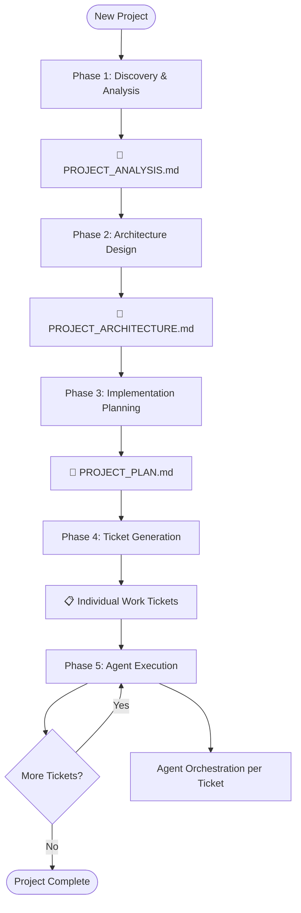
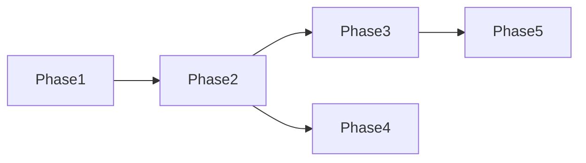
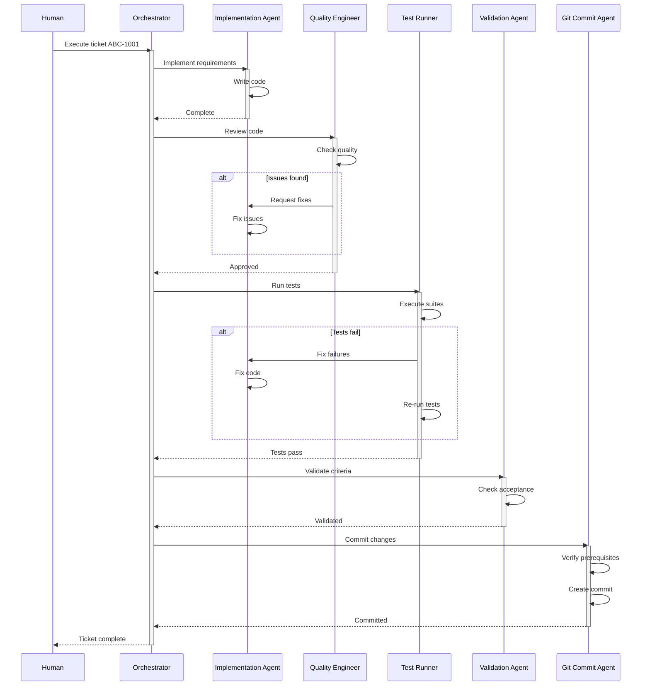

# Spec-Driven Development Process with Agent Orchestration

## Process Overview



---

## Phase 1: Discovery & Analysis

### Purpose
Understand the problem space, research solutions, and establish project context.

### Process
1. **Create Analysis Document**
   ```bash
   # Initialize analysis document
   Create: <PROJECT>_ANALYSIS.md
   ```

2. **Research & Document**
   - Industry/market research
   - Technical feasibility study
   - Existing solutions evaluation
   - Risk assessment
   - Success criteria definition

### Output: `<PROJECT>_ANALYSIS.md`

```markdown
# <PROJECT> Analysis

## Executive Summary
[1-2 paragraph overview of findings and recommendations]

## Problem Statement
### Current State
- What exists today
- Pain points
- Constraints

### Desired State
- Goals
- Success metrics
- User outcomes

## Research Findings
### Industry Analysis
- State of the art
- Common patterns
- Best practices

### Technical Landscape
- Available technologies
- Build vs buy options
- Integration requirements

### Competitive Analysis
[If applicable]

## Feasibility Assessment
### Technical Feasibility
- Required technologies
- Skill requirements
- Technical risks

### Resource Feasibility
- Time estimates
- Complexity assessment
- Dependency analysis

## Constraints & Assumptions
### Constraints
- Technical limitations
- Business requirements
- Compliance/regulatory

### Assumptions
- What we're taking as given
- Dependencies on other systems
- Market conditions

## Risk Analysis
| Risk | Probability | Impact | Mitigation Strategy |
|------|------------|--------|-------------------|
| [Risk description] | High/Med/Low | High/Med/Low | [Strategy] |

## Success Criteria
### Must Have
- [ ] Criterion 1 (measurable)
- [ ] Criterion 2 (measurable)

### Should Have
- [ ] Criterion 3
- [ ] Criterion 4

### Nice to Have
- [ ] Criterion 5

## Recommendations
### Recommended Approach
[Specific recommendation based on analysis]

### Alternative Options
1. Option B: [Description]
2. Option C: [Description]

## Next Steps
1. Proceed to architecture design
2. Key decisions needed
3. Open questions to resolve
```

---

## Phase 2: Architecture Design

### Purpose
Define the technical architecture, component design, and system structure.

### Process
1. **Create Architecture Document**
   ```bash
   # Initialize architecture document
   Create: <PROJECT>_ARCHITECTURE.md
   ```

2. **Design System**
   - Component architecture
   - Data models
   - Interface definitions
   - Integration patterns

### Output: `<PROJECT>_ARCHITECTURE.md`

```markdown
# <PROJECT> Architecture

## System Overview
[High-level description of the system architecture]

## Architecture Diagram
[Include mermaid diagram or ASCII art showing system components]

## Component Design
### Component: [Name]
#### Purpose
[What this component does]

#### Responsibilities
- Responsibility 1
- Responsibility 2

#### Interfaces
##### Inputs
- Interface 1: [Description]
- Interface 2: [Description]

##### Outputs  
- Interface 1: [Description]
- Interface 2: [Description]

#### Implementation Notes
- Key design decisions
- Technology choices
- Pattern usage

### [Repeat for each component]

## Data Architecture
### Data Models
#### Entity: [Name]
```json
{
  "field1": "type",
  "field2": "type"
}
```

### Data Flow
[Describe how data moves through the system]

### Storage Strategy
- Database choices
- Caching approach
- File storage

## Integration Architecture
### External Systems
| System | Integration Type | Protocol | Data Format |
|--------|-----------------|----------|-------------|
| System A | Sync/Async | REST/gRPC | JSON/XML |

### API Specifications
#### Endpoint: [Name]
- Method: GET/POST/PUT/DELETE
- Path: /api/v1/resource
- Request: [Schema]
- Response: [Schema]
- Errors: [Error codes]

## Security Architecture
### Authentication
[Approach and implementation]

### Authorization
[Permission model]

### Data Protection
[Encryption, PII handling]

## Infrastructure Architecture
### Deployment Architecture
[Containers, servers, cloud services]

### Scaling Strategy
[Horizontal/vertical scaling approach]

### Monitoring & Observability
[Logging, metrics, tracing]

## Technical Decisions
### Decision: [Technology/Pattern Choice]
#### Options Considered
1. Option A
2. Option B

#### Decision
[What was chosen and why]

#### Consequences
- Positive: [Benefits]
- Negative: [Trade-offs]

## Constraints
### Technical Constraints
- Must use existing [system/technology]
- Performance requirements
- Compatibility requirements

### Architectural Principles
- Principle 1: [e.g., "Prefer composition over inheritance"]
- Principle 2: [e.g., "Fail fast and explicitly"]
```

---

## Phase 3: Implementation Planning

### Purpose
Break down the architecture into implementable phases and specific work items.

### Process
1. **Create Implementation Plan**
   ```bash
   # Initialize plan document
   Create: <PROJECT>_PLAN.md
   ```

2. **Define Phases and Milestones**
   - Logical implementation sequence
   - Dependencies between phases
   - Deliverables per phase

### Output: `<PROJECT>_PLAN.md`

```markdown
# <PROJECT> Implementation Plan

## Implementation Strategy
[Overall approach to building the system]

## Phase Overview
| Phase | Name | Duration | Deliverable | Success Criteria |
|-------|------|----------|-------------|------------------|
| 1 | Foundation | X weeks | Core infrastructure | System boots, basic tests pass |
| 2 | Core Features | X weeks | Main functionality | Feature X, Y working |
| 3 | Integration | X weeks | External connections | APIs connected |
| 4 | Polish | X weeks | Production ready | All criteria met |

## Dependency Graph


## Phase Details

### Phase 1: Foundation
#### Goals
- Set up development environment
- Create project structure
- Implement core data models
- Basic infrastructure

#### Tickets
| Ticket ID | Title | Description | Estimated Hours |
|-----------|-------|-------------|-----------------|
| ABC-1001 | Setup repository | Initialize git, folder structure | 2 |
| ABC-1002 | Configure development | Docker, env variables | 4 |
| ABC-1003 | Create data models | Core entity definitions | 8 |
| ABC-1004 | Setup testing | Test framework, CI | 4 |

#### Exit Criteria
- [ ] Development environment working
- [ ] Tests running in CI
- [ ] Core models implemented
- [ ] Basic documentation

### Phase 2: Core Features
[Continue pattern...]

### Phase 3: Integration
[Continue pattern...]

### Phase 4: Polish & Production
[Continue pattern...]

## Risk Mitigation Schedule
| Phase | Risk | Mitigation Action | Checkpoint |
|-------|------|------------------|------------|
| 1 | Setup complexity | Early validation | Day 3 |
| 2 | API uncertainties | Prototype first | Week 2 |

## Resource Requirements
### Technical Requirements
- Development environment
- Access to systems
- Licenses needed

### Knowledge Requirements
- Technologies to learn
- Documentation to review
- Stakeholders to consult

## Success Metrics
### Per Phase
- Phase 1: [Specific metrics]
- Phase 2: [Specific metrics]

### Overall Project
- [ ] All acceptance criteria met
- [ ] Performance targets achieved
- [ ] Quality gates passed
```

---

## Phase 4: Ticket Generation

### Purpose
Transform plan items into detailed, agent-executable work tickets.

### Process
1. **For each item in the plan, create a ticket**
   ```bash
   # Create ticket file
   Create: tickets/<PROJECT>-<PHASE><TICKET>_<n>_<title>.md
   
   # Example: tickets/ABC-1001_setup_repository.md
   ```

2. **Define agent orchestration for each ticket**
   - Implementation instructions
   - Quality checks
   - Testing requirements
   - Validation criteria
   - Commit requirements

### Ticket Template

```markdown
# Ticket: <PROJECT>-<PHASE><TICKET>_<n>_<title>

## Status
- [ ] Not Started
- [ ] In Progress  
- [ ] Complete
- [ ] Verified

## Context
**References:**
- Architecture: [Link to relevant section]
- Dependencies: [Previous tickets]
- Related Tickets: [Tickets that interact with this]

**Background:**
[Why this ticket exists and what it accomplishes]

## Acceptance Criteria
- [ ] SPECIFIC: [Measurable criterion 1]
- [ ] SPECIFIC: [Measurable criterion 2]
- [ ] SPECIFIC: [Measurable criterion 3]
- [ ] All automated tests passing
- [ ] Documentation updated
- [ ] Code review complete

## Implementation
### Agent: implementation-agent

**Goal:** [Clear statement of what to build]

**Instructions:**
1. [Specific step 1]
2. [Specific step 2]
3. [Specific step 3]

**Files to Create/Modify:**
- `src/file1.js` - [What to do]
- `src/file2.js` - [What to do]

**Patterns to Follow:**
- Use pattern from [reference file/ticket]
- Follow convention established in [location]

**Example Code Structure:**
```javascript
// If helpful, provide a skeleton
class Example {
  method() {
    // Implement logic for X
  }
}
```

## Quality Engineering
### Agent: quality-engineer-agent

**Review Checklist:**
- [ ] Code follows project style guide
- [ ] No obvious security issues
- [ ] Error handling is comprehensive
- [ ] Performance considerations addressed
- [ ] No code duplication
- [ ] Clear naming and documentation

**Specific Checks:**
- Verify [specific quality aspect]
- Ensure [specific pattern usage]

## Testing
### Agent: test-runner-agent

**Test Execution:**
```bash
# Commands to run
npm test -- --coverage
npm run test:integration
```

**Required Test Coverage:**
- Minimum coverage: 80%
- Critical paths must have 100% coverage

**Test Categories:**
- Unit tests: [Which test files]
- Integration tests: [Which test files]
- E2E tests: [Which scenarios]

**Expected Output:**
```
✓ All tests passing
✓ Coverage > 80%
✓ No console errors
✓ Performance within bounds
```

## Validation
### Agent: validation-agent

**Validation Process:**
1. Verify all acceptance criteria checked
2. Confirm test report shows passing
3. Review implementation matches specification
4. Check documentation updates
5. Validate no regressions introduced

**Validation Report Template:**
```yaml
validation_complete: true/false
criteria_met: 
  - criterion_1: pass/fail
  - criterion_2: pass/fail
test_results: pass/fail
documentation_updated: yes/no
ready_for_commit: yes/no
issues_found: []
```

## Git Commit
### Agent: git-commit-agent

**Pre-commit Checklist:**
- [ ] Implementation agent confirmed complete
- [ ] Quality engineer approved
- [ ] All tests passing (test-runner confirmed)
- [ ] Validation agent approved
- [ ] No merge conflicts

**Commit Message:**
```
<ticket-id>: <type>(<scope>): <description>

Implementation: [What was built]
Tests: [What was tested]
Validation: [What was verified]

Closes: <ticket-id>
```

**Branch Strategy:**
- Branch name: `feature/<ticket-id>-<brief-description>`
- Base branch: `develop`
- Merge strategy: Squash and merge

## Rollback Plan
If this ticket causes issues:
1. [Specific rollback step]
2. [What to verify after rollback]
3. [Who to notify]

## Dependencies
### Depends On
- [Ticket ID]: [What it provides]

### Blocks
- [Ticket ID]: [What this enables]

## Time Tracking
- Estimated: X hours
- Actual: [Filled by agents]
  - Implementation: X hours
  - Testing: X hours
  - Fixes: X hours
- Total: X hours
```

---

## Phase 5: Agent Execution

### Purpose
Orchestrate specialized agents through each ticket to completion.

### Process Flow



### Execution Commands

```bash
# Start a ticket
/execute-ticket <ticket-id>

# Check ticket status
/ticket-status <ticket-id>

# Retry failed step
/retry-agent <ticket-id> <agent-name>

# Skip to specific agent (dangerous)
/force-agent <ticket-id> <agent-name>

# Rollback ticket
/rollback-ticket <ticket-id>
```

### Agent Instructions

#### Implementation Agent
```yaml
role: "Build the solution according to specifications"
inputs:
  - ticket specifications
  - architecture documents
  - existing codebase
outputs:
  - implemented code
  - updated files
capabilities:
  - write new code
  - modify existing code
  - create tests
  - update documentation
constraints:
  - follow existing patterns
  - maintain compatibility
  - respect architecture
```

#### Quality Engineer Agent
```yaml
role: "Ensure code quality and standards"
inputs:
  - implemented code
  - quality checklist
  - project standards
outputs:
  - quality report
  - improvement requests
capabilities:
  - analyze code quality
  - detect anti-patterns
  - suggest improvements
  - verify standards
constraints:
  - cannot modify code directly
  - must provide specific feedback
```

#### Test Runner Agent
```yaml
role: "Execute and verify tests"
inputs:
  - test suites
  - test requirements
  - code to test
outputs:
  - test results
  - coverage report
  - failure details
capabilities:
  - run test commands
  - parse test output
  - generate reports
  - identify failures
constraints:
  - cannot modify tests
  - must run all specified suites
```

#### Validation Agent
```yaml
role: "Verify acceptance criteria met"
inputs:
  - acceptance criteria
  - test results
  - implementation
outputs:
  - validation report
  - pass/fail decision
capabilities:
  - check criteria
  - verify completeness
  - assess readiness
constraints:
  - must be objective
  - cannot override test failures
```

#### Git Commit Agent
```yaml
role: "Commit verified changes"
inputs:
  - validation report
  - changed files
  - commit template
outputs:
  - git commit
  - commit message
capabilities:
  - stage changes
  - create commits
  - push to repository
constraints:
  - requires all validations
  - must follow message format
  - cannot commit if tests fail
```

---

## Quality Gates

### Per-Ticket Gates
1. **Implementation Complete** - Code written
2. **Quality Approved** - Meets standards
3. **Tests Passing** - All tests green
4. **Validation Passed** - Criteria met
5. **Committed** - Changes saved

### Per-Phase Gates
1. **All Tickets Complete** - Every ticket done
2. **Integration Tests Pass** - Phase works together
3. **Documentation Updated** - Docs current
4. **Stakeholder Review** - If needed
5. **Phase Retrospective** - Learnings captured

### Per-Project Gates
1. **All Phases Complete**
2. **End-to-End Tests Pass**
3. **Performance Validated**
4. **Security Review Complete**
5. **Production Readiness Confirmed**

---

## Monitoring & Reporting

### Daily Status
```markdown
## Daily Status: [Date]

### Progress
- Active Ticket: [ID]
- Status: [Agent currently working]
- Blockers: [Any issues]

### Completed Today
- [Ticket ID]: [Summary]

### Planned Tomorrow
- [Ticket ID]: [Summary]

### Metrics
- Velocity: X tickets/day
- Success Rate: X%
- Rework Rate: X%
```

### Phase Completion Report
```markdown
## Phase [N] Completion Report

### Summary
- Duration: Planned X days, Actual Y days
- Tickets: Completed X of Y
- Success Rate: Z%

### Achievements
- [What was delivered]

### Issues Encountered
- [Problems and resolutions]

### Learnings
- [What to improve]

### Ready for Next Phase
- [ ] All tickets complete
- [ ] Tests passing
- [ ] Documentation updated
- [ ] Stakeholders informed
```

---

## Common Patterns & Solutions

### Pattern: Dependency Chain
**Problem:** Ticket B needs Ticket A's output  
**Solution:** 
```yaml
ticket_b:
  dependencies:
    - ticket_a: 
        wait_for: complete
        use_output: [specific files/functions]
```

### Pattern: Parallel Work
**Problem:** Multiple independent tickets  
**Solution:**
```bash
/execute-parallel [ticket-1, ticket-2, ticket-3]
# Then merge results
/merge-tickets [ticket-1, ticket-2, ticket-3]
```

### Pattern: Complex Validation
**Problem:** Acceptance criteria requires human judgment  
**Solution:**
```yaml
validation:
  automated:
    - [What agents can verify]
  manual:
    - [What human must verify]
  manual_approval_required: true
```

### Pattern: Iterative Refinement
**Problem:** Ticket too complex for single pass  
**Solution:**
```markdown
## Sub-tickets
1. <ticket>-a: Basic implementation
2. <ticket>-b: Refinement
3. <ticket>-c: Optimization
```

---

## Troubleshooting

### Issue: Agent Confusion
**Symptoms:** Inconsistent or wrong implementation  
**Fix:** 
1. Clarify specifications
2. Add examples to ticket
3. Reference similar completed tickets
4. Reduce scope

### Issue: Test Failures
**Symptoms:** Tests fail but code looks correct  
**Fix:**
1. Check test assumptions
2. Verify test data
3. Review acceptance criteria
4. Consider environment issues

### Issue: Validation Loops
**Symptoms:** Can't pass validation  
**Fix:**
1. Review criteria specificity
2. Check for contradictions
3. Simplify requirements
4. Get human clarification

### Issue: Git Conflicts
**Symptoms:** Can't commit due to conflicts  
**Fix:**
1. Check ticket dependencies
2. Rebase on latest
3. Coordinate parallel work
4. Use feature flags

---

## Best Practices

### Writing Tickets
1. **Be Specific** - Vague instructions confuse agents
2. **Include Examples** - Show what success looks like
3. **Reference Patterns** - Point to existing code
4. **Define Boundaries** - What NOT to change
5. **Clear Criteria** - Measurable, not subjective

### Agent Management
1. **One Agent at a Time** - Avoid parallel agent confusion
2. **Clear Handoffs** - Each agent's output feeds the next
3. **Preserve Context** - Pass forward relevant information
4. **Fail Fast** - Don't continue if prerequisites fail
5. **Human Escalation** - Know when to involve humans

### Process Improvement
1. **Retrospectives** - Learn from each phase
2. **Template Evolution** - Improve templates based on experience
3. **Metric Tracking** - Measure to improve
4. **Pattern Library** - Build reusable solutions
5. **Agent Training** - Use successful tickets as examples