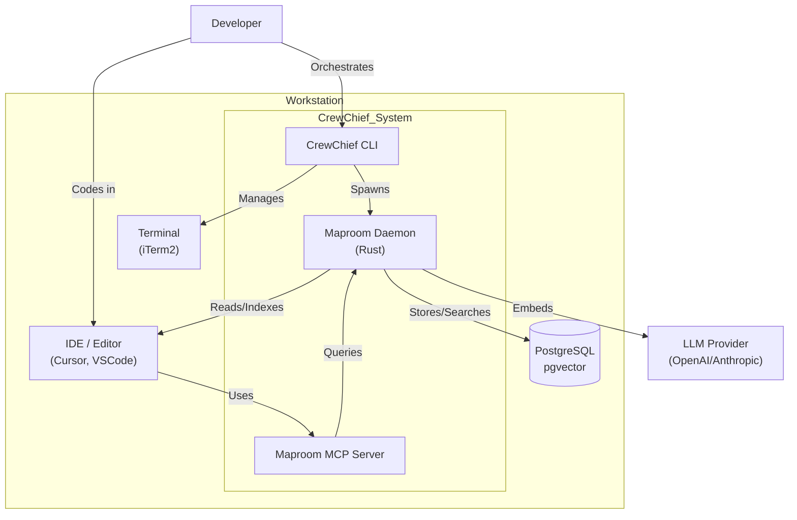
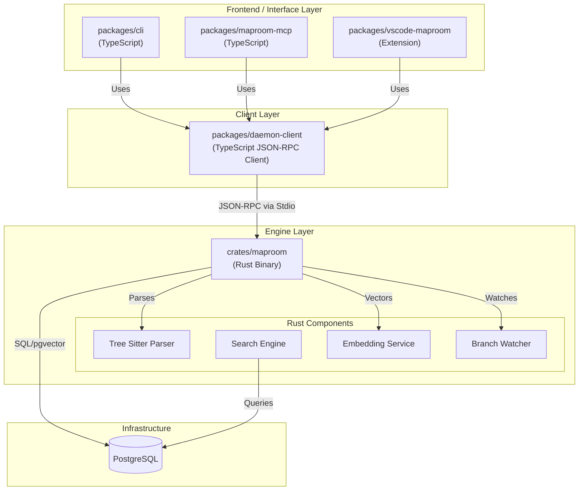
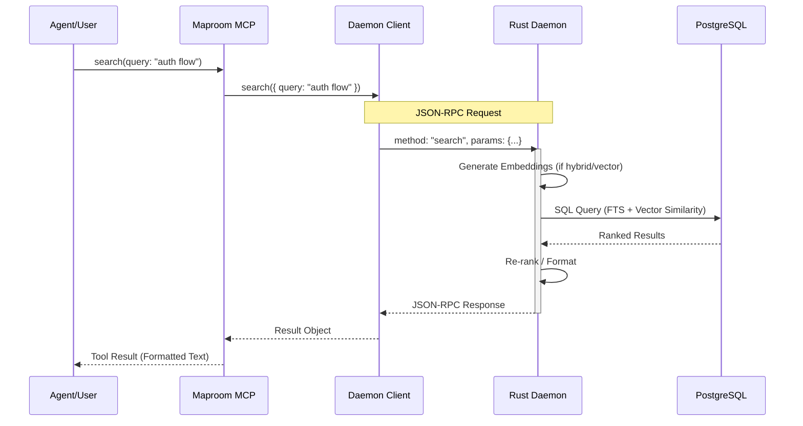
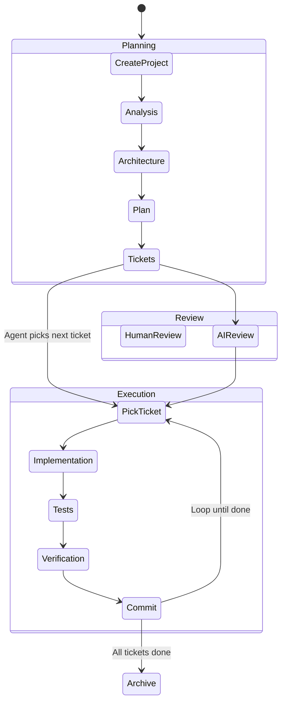

# System Architecture Diagrams

**Date**: November 25, 2025
**Project**: CrewChief

## 1. System Context Diagram

This diagram shows how CrewChief fits into the user's environment.

## 2. Container Diagram (Detailed Architecture)

This diagram details the internal components and their communication protocols.

## 3. Sequence Diagram: Semantic Search Flow

Tracing a search request from the User/Agent to the Database.

## 4. Agent Workflow Diagram

How the `.agents` system works.

