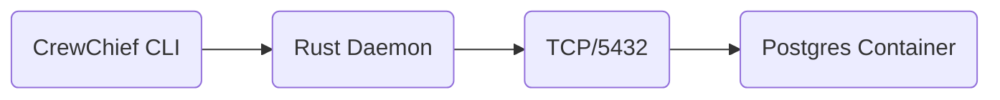
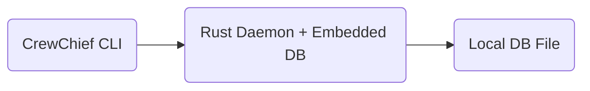

# Embedded Database Investigation: Zero-Dependency Architecture

**Date**: November 25, 2025
**Subject**: Evaluation of Embedded Backends to replace Dockerized PostgreSQL

## 1. The Problem
Current Architecture:

**Issues:**
1.  **Heavy Dependency**: Requires Docker Desktop / Engine running.
2.  **Setup Friction**: `docker-compose up` takes time and resources.
3.  **Portability**: Hard to run in CI/CD, extensive permission requirements.

Target Architecture:


## 2. Candidate Evaluation

### Option A: PGlite (WASM Postgres)
*   **Concept**: Run Postgres compiled to WASM inside the Rust binary (via Wasmtime) or Node process.
*   **Pros**: 1:1 compatibility with current Postgres schema and queries.
*   **Cons**:
    *   **Not Native**: Designed for JS/Browser environments.
    *   **Complexity**: Embedding a WASM runtime into the Rust daemon adds significant complexity and marshalling overhead.
    *   **Performance**: WASM is slower than native code.
*   **Verdict**: **REJECTED** for the Rust daemon. (Great for a VSCode-only version, but not for the high-performance CLI).

### Option B: SQLite + sqlite-vec (Recommended)
*   **Concept**: Use `rusqlite` to embed SQLite and statically link `sqlite-vec` (C extension).
*   **Pros**:
    *   **True Zero-Dependency**: Compiles to a single binary.
    *   **Native Performance**: No network overhead, runs in-process.
    *   **FTS Support**: SQLite FTS5 is excellent for text search.
    *   **Vector Support**: `sqlite-vec` provides simple cosine similarity.
*   **Cons**:
    *   **Migration**: Requires rewriting SQL queries (Postgres -> SQLite dialect).
    *   **Concurrency**: SQLite writes are serialized (though WAL mode helps).
*   **Verdict**: **RECOMMENDED** for local desktop usage.

### Option C: LanceDB (Rust Native)
*   **Concept**: Use `lancedb` crate, a serverless vector DB built on Arrow.
*   **Pros**:
    *   **Blazing Fast**: Optimized for vector search.
    *   **Rust Native**: First-class Rust API.
*   **Cons**:
    *   **Weak Relational Support**: Managing complex file metadata, worktree states, and chunk relationships is harder without full SQL joins.
    *   **FTS Limitations**: Full-text search is less mature than SQLite FTS5.
*   **Verdict**: **Promising**, but maybe too specialized. Good for pure vector search, harder for the hybrid app logic.

## 3. Implementation Strategy: "sqlite-vec"

To move to SQLite, we would implement a **Storage Abstraction Layer** in `crates/maproom`.

```rust
// crates/maproom/src/db/mod.rs

#[async_trait]
pub trait VectorStore {
    async fn search(&self, query: Vector, limit: usize) -> Result<Vec<SearchResult>>;
    async fn insert(&self, chunks: Vec<Chunk>) -> Result<()>;
}

// We then have two implementations:
// 1. PostgresStore (Current, for server/cloud deployments)
// 2. SqliteStore (New, for local zero-dependency CLI)
```

### Migration Plan
1.  **Define Trait**: Extract current `tokio-postgres` calls into a generic trait.
2.  **Add Feature Flag**: `cargo build --features sqlite` (or make it default).
3.  **Build Sqlite Store**:
    *   Use `rusqlite`.
    *   Bundle `sqlite-vec` source in `build.rs` (cc build).
    *   Re-implement schema (tables + FTS virtual tables).
4.  **Dual Mode**: Allow user to choose via config.
    *   `crewchief config set db.provider sqlite` -> Use local file `~/.crewchief/maproom.db`
    *   `crewchief config set db.provider postgres` -> Connect to URL.

## 4. Conclusion

Adopting **SQLite with sqlite-vec** is the most viable path to a "zero-dependency" CrewChief. It removes the Docker requirement while retaining the SQL capabilities needed for complex code metadata management. PGlite is not suitable for this native-binary context.

