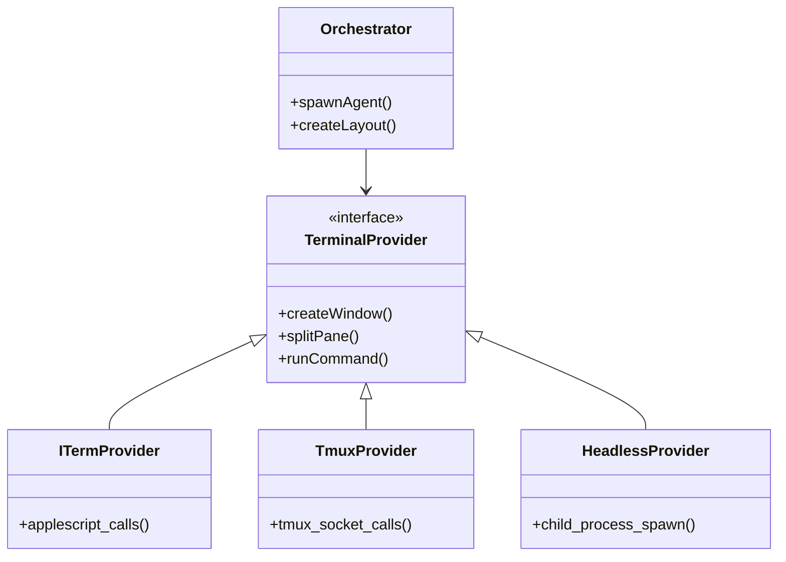

# Recommendations & Improvement Plan

**Date**: November 25, 2025
**Author**: Architectural Analysis Agent

Based on the comprehensive analysis, the following recommendations are proposed to improve maintainability, DX, and agent capability.

## 1. Infrastructure & Portability

### Problem
The current CLI heavily relies on macOS-specific tools (`iTerm.app` check in `packages/cli/src/cli/index.ts`) and a heavy external dependency (PostgreSQL via Docker).

### Recommendation: "Headless" Core
- **Action**: Refactor `packages/cli` to abstract the "Terminal Provider".
- **Benefit**: Enables running CrewChief in CI/CD, Linux DevContainers, or Windows without iTerm2.
- **Implementation**:
  - Create `interface TerminalProvider { spawn(...): Promise<void>; layout(...): Promise<void>; }`
  - Implement `ITermProvider`, `TmuxProvider`, and `HeadlessProvider`.

### Recommendation: Embedded Database Tier
- **Action**: Adopt **sqlite-vec** as the zero-dependency backend for the Rust daemon.
- **Rationale**:
  - **Why not PGlite?**: PGlite is WASM-based and optimized for JS environments. Running it inside a native Rust binary introduces unnecessary complexity (embedding a WASM runtime) and performance overhead.
  - **Why SQLite?**: It can be statically linked into the Rust binary (`rusqlite` + `sqlite-vec` C extension), resulting in a single, portable executable with zero external dependencies (no Docker required).
- **Implementation Strategy**:
  1.  Abstract database access in `crates/maproom` via a `VectorStore` trait.
  2.  Implement `SqliteStore` using `rusqlite` and `sqlite-vec` for vector ops.
  3.  Retain `PostgresStore` for server/cloud deployments.
  4.  See full report: `embedded-db-investigation.md`.

## 2. Agent Workflow Maturity

### Problem
The `.agents` workflow is powerful but relies on "Prompt Engineering" in `.claude/commands` to guide the AI. This is fragile (model updates can break prompts).

### Recommendation: Codify Workflow
- **Action**: Convert `.claude/commands` logic into actual CLI commands in `packages/cli`.
- **Example**: Instead of a prompt saying "Read the plan and create tickets", implement `crewchief tickets generate --plan=plan.md`.
- **Benefit**: Deterministic behavior. The AI then *calls* the tool rather than *interpreting* a long prompt instruction.

## 3. Architecture Decoupling

### Problem
`packages/maproom-mcp` spawns the daemon. `packages/cli` also seems to manage the daemon. There is potential for "Daemon Contention" if multiple tools try to own the lifecycle.

### Recommendation: Explicit Daemon Management
- **Action**: Treat the Daemon as a system service.
- **Implementation**:
  - `crewchief daemon start`: Starts the background process.
  - `crewchief daemon status`: Checks health.
  - MCP and CLI just *connect* to the running daemon socket/port rather than spawning their own child processes.

## 4. Documentation & Knowledge Graph

### Problem
Documentation is split between `docs/` and `.agents/`. Knowledge synthesis (moving from agents -> docs) is a manual step that often gets missed.

### Recommendation: "Knowledge Upsert" Tool
- **Action**: Create a specific tool for agents to "promote" a finding to the permanent docs.
- **Usage**: When an agent solves a tricky bug, they run `upsert_knowledge({ topic: "Postgres Tuning", content: "..." })` which appends to `docs/knowledge-base.md`.

## 5. Proposed Diagram: The "Universal" Terminal Provider

