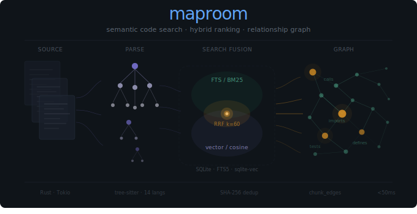

# Maproom

<p align="center">
  
</p>

Semantic code search powered by embeddings and SQLite.

Maproom indexes your codebase using tree-sitter, stores chunks in a local SQLite database, and enables both full-text and vector similarity search. It runs as a CLI tool or as an MCP server for integration with AI coding assistants.

## Features

- **Semantic Code Search** - Find code by concept, not just keywords
- **Full-Text Search** - Works immediately with no setup beyond indexing
- **Multi-Provider Embeddings** - Ollama (free/local), OpenAI, or Google Vertex AI
- **SQLite Storage** - Portable, zero-config database with FTS5 and sqlite-vec
- **Incremental Indexing** - Only re-indexes changed files
- **MCP Server** - Integrates with Claude Code, Cursor, and other MCP-compatible tools
- **10+ Languages** - TypeScript, JavaScript, Rust, Python, Go, Ruby, C, C#, Java, C++, Markdown, and config formats

## Installation

```bash
cargo install maproom
```

## Quick Start

### 1. Install Ollama (Free, Local)

```bash
curl -sSL https://ollama.ai/install.sh | sh
ollama pull nomic-embed-text
```

### 2. Index Your Repository

```bash
maproom scan --generate-embeddings
```

### 3. Search Your Code

```bash
maproom search "authentication middleware"
```

No API keys, no configuration, no costs.

## Embedding Providers

| Provider | Cost | Dimensions | Best For |
|----------|------|------------|----------|
| **Ollama** | Free | 768 | Local dev, privacy |
| **OpenAI** | ~$0.0001/1K tokens | 1536 | Proven quality |
| **Google Vertex AI** | ~$0.00025/1K tokens | 768 | Enterprise, compliance |

### Provider Selection

Maproom auto-detects your provider:

1. Checks `MAPROOM_EMBEDDING_PROVIDER` env var
2. Detects Ollama on localhost:11434
3. Falls back to OpenAI if `OPENAI_API_KEY` is set
4. Falls back to Google if `GOOGLE_PROJECT_ID` is set

```bash
# Explicit selection
export MAPROOM_EMBEDDING_PROVIDER=ollama  # or: openai, google
```

## Usage

### Indexing

```bash
# Index current directory
maproom scan

# Index with embeddings
maproom scan --generate-embeddings

# Index a specific path
maproom scan --repo myproject --worktree main --path /path/to/code --commit $(git rev-parse HEAD)
```

### Generating Embeddings

```bash
# Generate for all unembedded chunks (incremental by default)
maproom generate-embeddings

# Test with a small sample
maproom generate-embeddings --sample 100 --dry-run

# Force regeneration
maproom generate-embeddings --force
```

### Searching

```bash
# Full-text search
maproom search --repo myproject --worktree main --query "authentication" --k 10
```

### Database

```bash
# Initialize/migrate database (auto-creates if needed)
maproom db migrate
```

## Language Support

| Language | Extensions | Extracted Constructs |
|----------|-----------|---------------------|
| TypeScript | `.ts`, `.tsx` | Functions, classes, interfaces, types, imports, exports |
| JavaScript | `.js`, `.jsx` | Functions, classes, imports, exports |
| Rust | `.rs` | Functions, structs, enums, traits, impls, modules |
| Python | `.py` | Functions, classes, imports, decorators |
| Go | `.go` | Functions, types, interfaces, structs |
| Ruby | `.rb` | Methods, classes, modules, constants |
| C | `.c` | Functions, structs, enums, typedefs, variables, includes |
| C# | `.cs` | Classes, methods, properties, interfaces |
| Java | `.java` | Classes, methods, interfaces, enums |
| C++ | `.cpp` | Functions, classes, structs, namespaces |
| Markdown | `.md` | Headings, sections |
| Config | `.json`, `.yaml`, `.toml` | Keys, structure |

## Environment Variables

### Database

- `MAPROOM_DATABASE_URL` - SQLite path (default: `~/.maproom/maproom.db`)

### Provider-Specific

**Ollama** (default - no config required):
- `OLLAMA_URL` - Override URL (default: `http://localhost:11434`)

**OpenAI**:
- `OPENAI_API_KEY` - API key
- `MAPROOM_EMBEDDING_PROVIDER=openai`

**Google Vertex AI**:
- `GOOGLE_PROJECT_ID` - GCP project ID
- `GOOGLE_APPLICATION_CREDENTIALS` - Service account key path
- `MAPROOM_EMBEDDING_PROVIDER=google`

### Tuning

- `MAPROOM_EMBEDDING_MODEL` - Model name override
- `MAPROOM_EMBEDDING_BATCH_SIZE` - API batch size (default: 100)
- `MAPROOM_EMBEDDING_CACHE_SIZE` - LRU cache size (default: 10000)
- `MAPROOM_EMBEDDING_CACHE_TTL` - Cache TTL in seconds (default: 3600)
- `MAPROOM_EMBEDDING_DIMENSION` - Override embedding dimensions

## License

MIT
