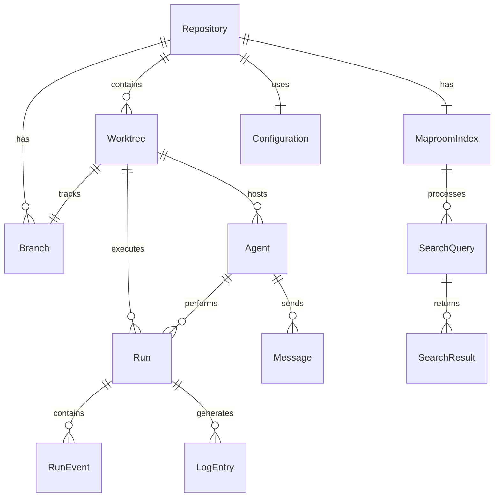

# Information Architecture

## Data Models and Relationships

### Core Entities

#### 1. Repository
```typescript
interface Repository {
  id: string
  path: string
  name: string
  currentBranch: string
  remoteUrl?: string
  lastFetch: Date
  config: CrewChiefConfig
}
```

#### 2. Worktree
```typescript
interface Worktree {
  id: string
  repositoryId: string
  name: string
  path: string
  branch: string
  status: 'active' | 'stale' | 'merging' | 'archived'
  createdAt: Date
  lastModified: Date
  gitStatus: GitStatus
  agents: Agent[]
}
```

#### 3. MaproomIndex
```typescript
interface MaproomIndex {
  id: string
  repositoryId: string
  worktreeId?: string
  status: 'idle' | 'indexing' | 'error'
  statistics: {
    totalFiles: number
    totalChunks: number
    totalSize: number
    languages: Record<string, number>
    lastIndexed: Date
  }
  config: {
    excludePatterns: string[]
    includePatterns: string[]
    chunkSize: number
  }
}
```

#### 4. SearchQuery
```typescript
interface SearchQuery {
  id: string
  query: string
  filters: {
    worktree?: string
    fileTypes?: string[]
    dateRange?: { from: Date; to: Date }
  }
  results: SearchResult[]
  performance: {
    executionTime: number
    resultCount: number
    relevanceScore: number
  }
  createdAt: Date
  userId?: string
}
```

#### 5. Agent
```typescript
interface Agent {
  id: string
  type: 'claude' | 'gemini' | 'mock' | string
  status: 'idle' | 'working' | 'blocked' | 'error' | 'closed'
  worktreeId: string
  tmuxPane?: {
    sessionName: string
    windowIndex: number
    paneIndex: number
  }
  task: {
    description: string
    assignedAt: Date
    completedAt?: Date
  }
  resources: {
    cpuUsage: number
    memoryUsage: number
    diskIO: number
  }
  messages: Message[]
}
```

#### 6. Run
```typescript
interface Run {
  id: string
  agentId: string
  worktreeId: string
  status: 'pending' | 'running' | 'completed' | 'failed'
  task: string
  startTime: Date
  endTime?: Date
  events: RunEvent[]
  logs: LogEntry[]
  evaluation?: {
    score: number
    testsPassed: boolean
    reviewRequired: boolean
  }
  artifacts: {
    filesModified: string[]
    filesCreated: string[]
    filesDeleted: string[]
    commits: string[]
  }
}
```

#### 7. Branch
```typescript
interface Branch {
  name: string
  repositoryId: string
  worktreeId?: string
  upstream?: string
  lastCommit: {
    sha: string
    message: string
    author: string
    date: Date
  }
  ahead: number
  behind: number
  isProtected: boolean
  pullRequest?: {
    number: number
    url: string
    status: 'open' | 'closed' | 'merged'
  }
}
```

#### 8. Configuration
```typescript
interface Configuration {
  id: string
  name: string // 'default' | 'local' | profile name
  path: string
  content: CrewChiefConfig
  isActive: boolean
  lastModified: Date
  validationErrors?: ValidationError[]
}
```

### Relationships



## Navigation Structure

### Primary Navigation
1. **Dashboard** - Overview and quick actions
2. **Search** - Maproom search interface
3. **Worktrees** - Worktree management
4. **Agents** - Agent orchestration
5. **Branches** - Branch visualization
6. **Settings** - Configuration management

### Secondary Navigation
- **Runs** - Historical run browser
- **Logs** - System log viewer
- **Monitor** - System health dashboard
- **Help** - Documentation and guides

### Information Hierarchy

```
├── Dashboard
│   ├── Quick Stats
│   ├── Recent Activity
│   ├── Active Agents
│   └── Quick Actions
│
├── Search (Maproom)
│   ├── Search Bar
│   ├── Filters Panel
│   ├── Results List
│   ├── Code Preview
│   └── Search History
│
├── Worktrees
│   ├── Worktree List
│   │   ├── Status Badge
│   │   ├── Branch Info
│   │   └── Actions Menu
│   ├── Create Worktree
│   ├── Worktree Details
│   │   ├── File Explorer
│   │   ├── Git Status
│   │   ├── Recent Commits
│   │   └── Active Agents
│   └── Bulk Operations
│
├── Agents
│   ├── Agent Grid
│   │   ├── Status Card
│   │   ├── Resource Usage
│   │   └── Current Task
│   ├── Spawn Agent
│   ├── Message Center
│   ├── Competition Mode
│   └── Agent Logs
│
├── Branches
│   ├── Branch Graph
│   ├── Branch List
│   ├── Merge Tool
│   └── PR Manager
│
└── Settings
    ├── Configuration Editor
    ├── Environment Variables
    ├── System Preferences
    └── Profile Manager
```

## State Management

### Global State
```typescript
interface AppState {
  // Current context
  currentRepository: Repository
  currentWorktree?: Worktree
  currentAgent?: Agent
  
  // UI state
  theme: 'light' | 'dark' | 'system'
  layout: LayoutConfig
  notifications: Notification[]
  
  // Cache
  searchHistory: SearchQuery[]
  recentRuns: Run[]
  
  // Real-time
  websocket: {
    connected: boolean
    subscriptions: string[]
  }
}
```

### Local Component State
- Form inputs and validation
- UI toggles (expanded/collapsed)
- Pagination and filtering
- Sort preferences
- Selected items

### Persistent Storage

**LocalStorage**
- User preferences
- Search history
- UI layout
- Recent items
- Draft configurations

**SessionStorage**
- Active filters
- Scroll positions
- Temporary selections
- Form drafts

**IndexedDB**
- Large search results
- Cached file contents
- Log archives
- Performance metrics

## API Data Flow

### Query Patterns

**REST APIs**
- CRUD operations
- Batch operations
- File uploads/downloads
- Configuration updates

**GraphQL Queries**
```graphql
query WorktreeDetails($id: ID!) {
  worktree(id: $id) {
    id
    name
    branch
    agents {
      id
      status
      currentTask
    }
    recentCommits(limit: 10) {
      sha
      message
      author
    }
  }
}
```

**WebSocket Events**
```typescript
// Subscribe to real-time updates
ws.subscribe('worktree:status', (data) => {
  updateWorktreeStatus(data)
})

ws.subscribe('agent:message', (data) => {
  appendAgentMessage(data)
})

ws.subscribe('index:progress', (data) => {
  updateIndexProgress(data)
})
```

### Data Synchronization

**Optimistic Updates**
1. Update UI immediately
2. Send request to server
3. Rollback on error
4. Sync on success

**Polling Strategies**
- Dashboard stats: 5 seconds
- Agent status: 1 second (when active)
- Git status: 10 seconds
- System health: 30 seconds

**Cache Invalidation**
- Time-based expiry
- Event-based updates
- Manual refresh
- Version-based cache busting

## Search and Discovery

### Search Scopes
1. **Code Search** (Maproom)
   - Full-text search
   - Semantic search
   - Symbol search
   - File path search

2. **UI Search**
   - Settings search
   - Command palette
   - Agent search
   - Run history search

### Filtering Capabilities
- Multi-faceted filtering
- Saved filter sets
- Quick filters
- Advanced query builder

### Sort Options
- Relevance (default)
- Date modified
- Alphabetical
- Size
- Custom scoring

## Performance Considerations

### Data Loading
- Lazy loading for large lists
- Virtual scrolling for logs
- Progressive enhancement
- Skeleton screens

### Caching Strategy
- CDN for static assets
- Service worker for offline
- Memory cache for active data
- Disk cache for archives

### Optimization Techniques
- Code splitting
- Tree shaking
- Image optimization
- Compression (gzip/brotli)
- Database indexing