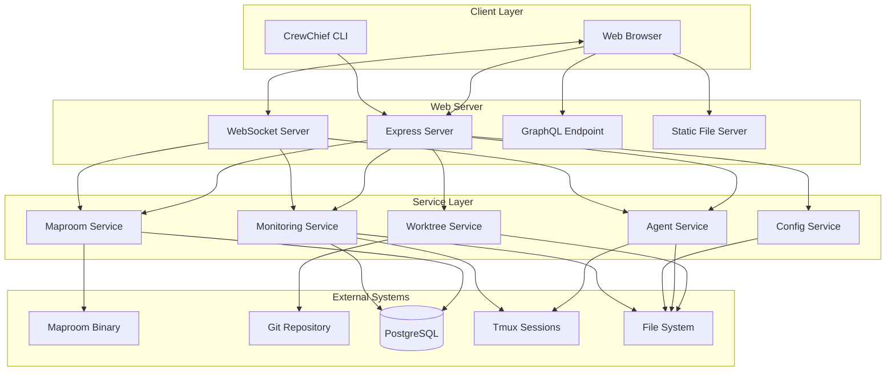
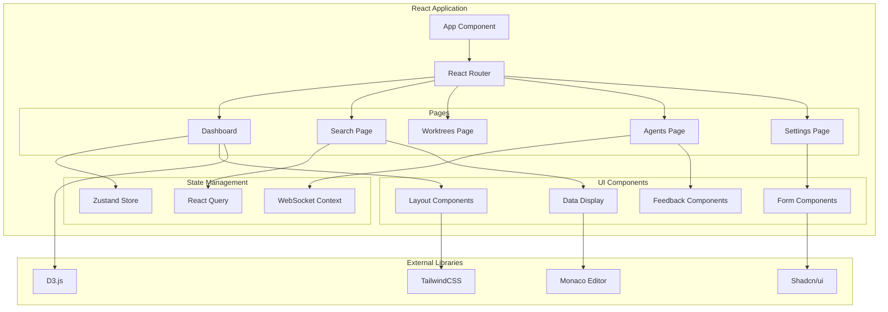
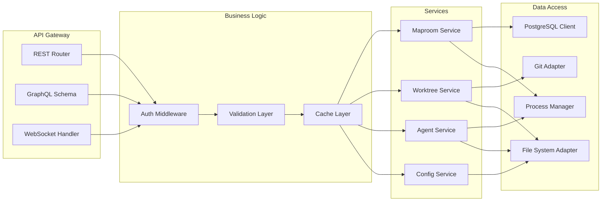
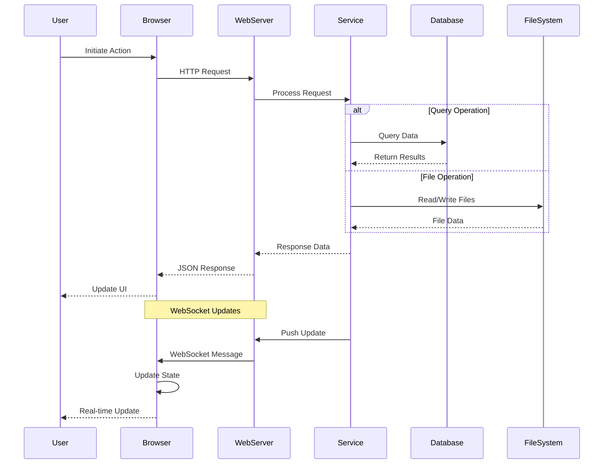
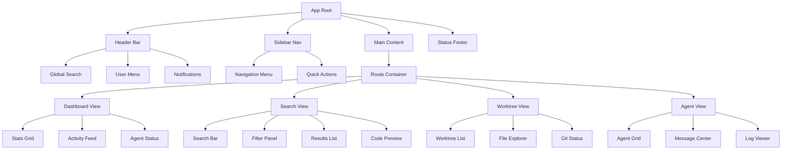
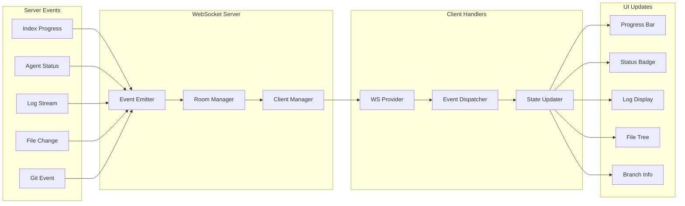
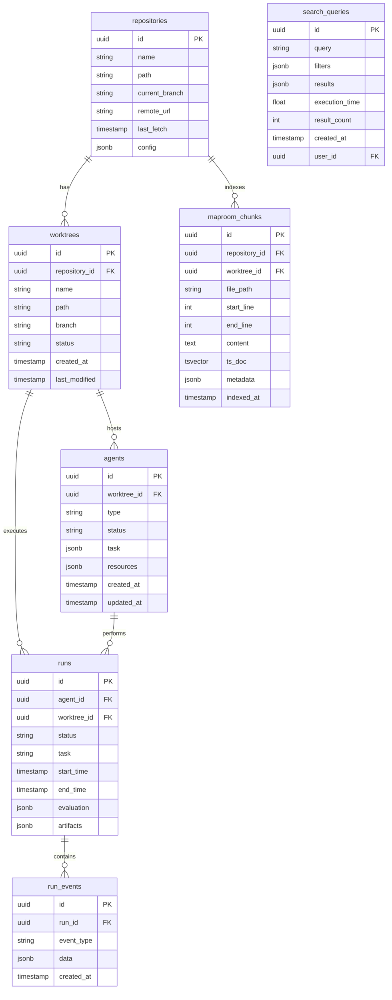
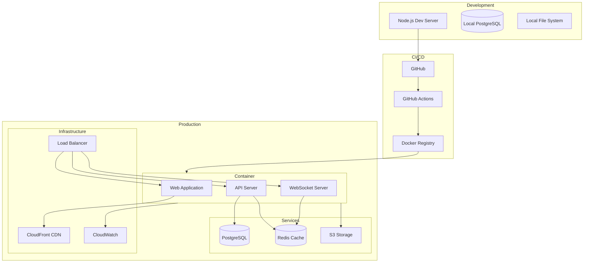
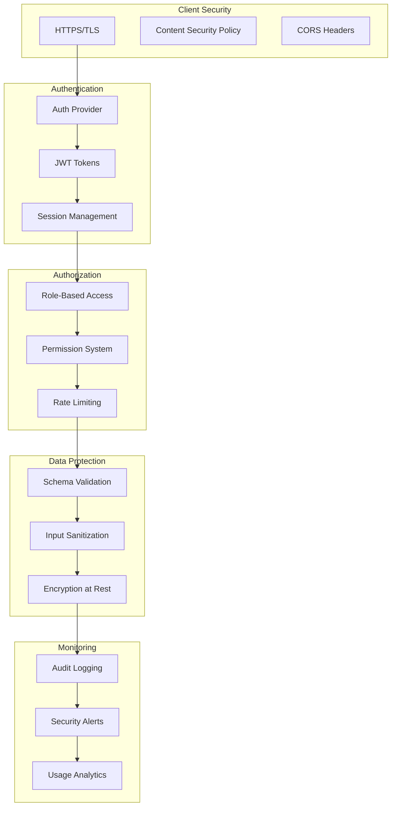

# System Architecture Diagrams

## Overall System Architecture

## Frontend Architecture

## Backend Service Architecture

## Data Flow Architecture

## Component Hierarchy

## WebSocket Event Flow

## Database Schema

## Deployment Architecture

## Security Architecture

