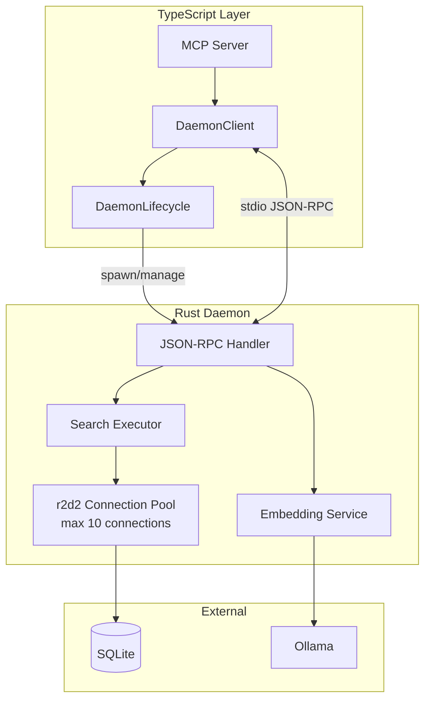

# Daemon Architecture

The Maproom daemon (`crewchief-maproom serve`) provides persistent database connections and search execution, offering 20-50x performance improvement over process-per-request patterns.

## Overview



## Communication Protocol

### JSON-RPC 2.0 over stdio

The daemon communicates via JSON-RPC 2.0 over stdin/stdout:

```json
// Request
{"jsonrpc": "2.0", "id": 1, "method": "search", "params": {"query": "auth", "repo": "myapp"}}

// Response
{"jsonrpc": "2.0", "id": 1, "result": {"hits": [...], "total": 42}}

// Error
{"jsonrpc": "2.0", "id": 1, "error": {"code": -32000, "message": "Database error"}}
```

**Framing:** Newline-delimited JSON (one message per line).

### Available Methods

| Method | Description |
|--------|-------------|
| `ping` | Health check, returns "pong" |
| `search` | Execute hybrid/FTS/vector search |
| `scan` | Index repository files |
| `upsert` | Update specific files |
| `context` | Assemble related code context |
| `status` | Return index statistics |

## Lifecycle Management

### Startup

```typescript
// DaemonLifecycle.start()
const daemon = spawn('crewchief-maproom', ['serve'], {
  stdio: ['pipe', 'pipe', 'pipe'],
  env: { ...process.env, RUST_LOG: 'info' }
});
```

The daemon:
1. Initializes Tokio async runtime
2. Opens SQLite connection pool (r2d2, max 10)
3. Loads sqlite-vec extension
4. Runs pending migrations
5. Emits ready signal on stdout
6. Enters JSON-RPC request loop

### Auto-Restart with Backoff

On unexpected daemon exit, the lifecycle manager implements exponential backoff:

```
Attempt 1: Immediate restart
Attempt 2: Wait 100ms
Attempt 3: Wait 200ms
Attempt 4: Wait 400ms
...
Attempt N: Wait min(100ms × 2^(N-2), 5000ms)
```

After 5 consecutive failures within 30 seconds, the circuit breaker opens:
- All requests fail immediately with `DaemonUnhealthyError`
- Circuit stays open for 30 seconds
- After cooldown, next request triggers new spawn attempt

### Graceful Shutdown

```typescript
// DaemonClient.stop()
daemon.stdin.end();           // Signal EOF
await daemon.waitForExit();   // Wait for clean exit
```

The daemon handles SIGTERM/SIGINT:
1. Stops accepting new requests
2. Completes in-flight requests
3. Flushes SQLite WAL
4. Closes connection pool
5. Exits with code 0

## Connection Pooling

### SQLite Pool (r2d2)

```rust
let pool = r2d2::Pool::builder()
    .max_size(10)
    .build(manager)?;
```

**Configuration:**
- Max connections: 10
- WAL mode enabled (concurrent reads)
- Busy timeout: 5000ms
- Foreign keys: ON

**Why pooling matters:**
- SQLite connection setup: ~10-50ms
- Pooled connection acquisition: ~0.1ms
- 100-500x faster for sequential requests

### Request Handling

```rust
// Each request gets a connection from pool
async fn handle_search(pool: &Pool, params: SearchParams) -> Result<SearchResult> {
    let conn = pool.get()?;  // Blocks until available
    // Execute search...
    // Connection returned to pool on drop
}
```

## Performance Characteristics

### Daemon vs Process Spawn

| Metric | Process Spawn | Daemon |
|--------|---------------|--------|
| First request | 225ms | 225ms (startup) |
| Subsequent requests | 160-400ms | 20-50ms |
| Connection overhead | Full setup each time | Pooled |
| Memory per request | ~50MB process | Shared |

### Why 20-50x Faster

1. **No process spawn overhead** - Avoids fork/exec for each request
2. **Connection pooling** - Reuses SQLite connections
3. **Warm caches** - OS page cache, SQLite cache persist
4. **No serialization** - Binary stays loaded in memory

## Error Handling

### Error Types

```typescript
// Timeout waiting for response
throw new DaemonTimeoutError('Request timed out after 30s');

// Daemon process crashed
throw new DaemonCrashError('Daemon exited with code 1');

// Too many restarts
throw new DaemonUnhealthyError('Circuit breaker open');

// JSON-RPC error from daemon
throw new DaemonError('Database error: SQLITE_BUSY');
```

### Recovery Strategies

| Error | Recovery |
|-------|----------|
| Timeout | Retry once, then fail |
| Crash | Auto-restart with backoff |
| Unhealthy | Wait for circuit reset |
| SQLITE_BUSY | Built-in retry (busy_timeout) |

## Configuration

### Environment Variables

```bash
# Database path (default: ~/.maproom/maproom.db)
MAPROOM_DATABASE_URL=sqlite://path/to/db.sqlite

# Logging level
RUST_LOG=info  # debug, trace for more detail

# Embedding provider
MAPROOM_EMBEDDING_PROVIDER=ollama
MAPROOM_EMBEDDING_MODEL=mxbai-embed-large
```

### Daemon Client Config

```typescript
const client = new DaemonClient({
  binaryPath: '/path/to/crewchief-maproom',
  requestTimeout: 30000,      // 30s per request
  startupTimeout: 10000,      // 10s for daemon to start
  maxRestartAttempts: 5,      // Before circuit opens
  circuitResetTimeout: 30000, // Cooldown period
});
```

## Debugging

### Enable Trace Logging

```bash
RUST_LOG=trace crewchief-maproom serve
```

### Check Daemon Status

```bash
# Via MCP
curl -X POST ... '{"method": "ping"}'

# Direct process check
pgrep -f "crewchief-maproom serve"
```

### Common Issues

| Symptom | Cause | Solution |
|---------|-------|----------|
| Slow first request | Daemon starting | Expected, cache warms up |
| Repeated restarts | Crash loop | Check `RUST_LOG=debug` |
| SQLITE_BUSY | Concurrent writes | WAL mode handles this |
| Connection refused | Daemon not running | Check spawn logs |

## Implementation Files

- `packages/daemon-client/src/client.ts` - DaemonClient class
- `packages/daemon-client/src/lifecycle.ts` - Spawn and restart logic
- `packages/daemon-client/src/rpc.ts` - JSON-RPC protocol
- `crates/maproom/src/main.rs` - Rust daemon entry point
- `crates/maproom/src/db/sqlite/mod.rs` - SQLite connection pool
