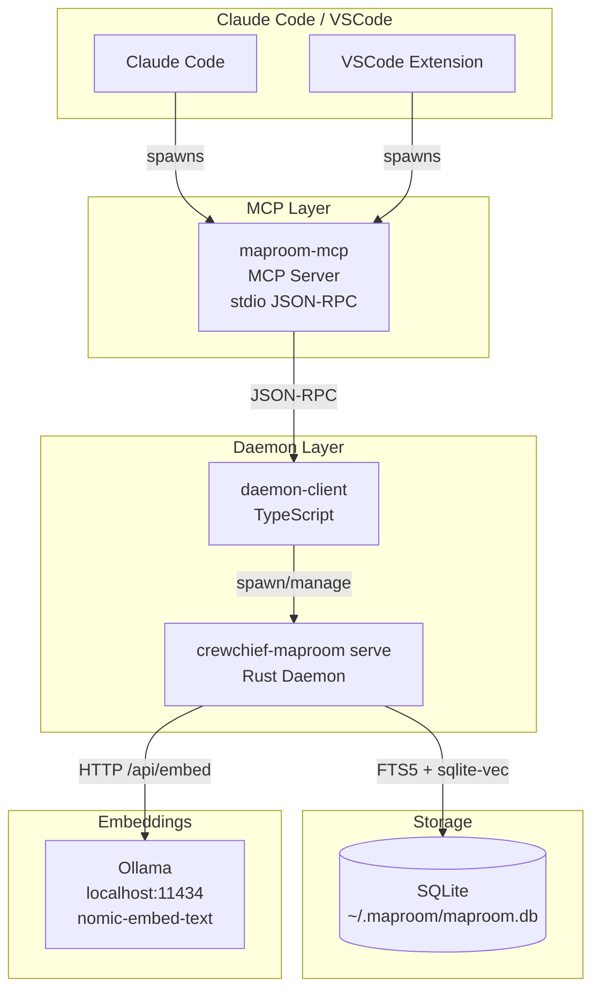
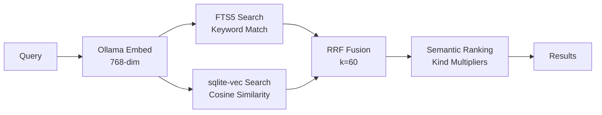
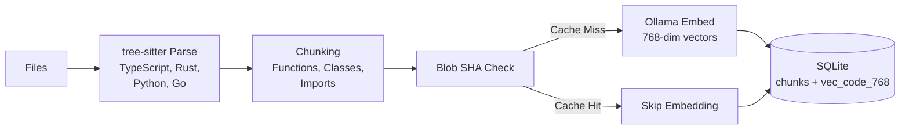
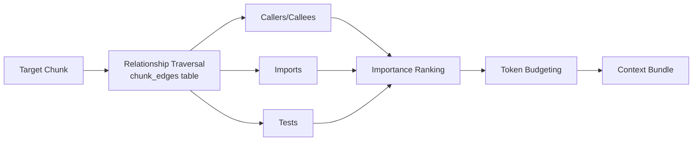

# Maproom Architecture Overview

Maproom provides semantic code search using local embedding generation and SQLite storage. This document describes the target architecture for zero-config local development.

## System Architecture



## Component Overview

| Component | Technology | Purpose |
|-----------|------------|---------|
| **MCP Server** | TypeScript | Bridge between AI tools and search daemon |
| **Daemon Client** | TypeScript | Type-safe JSON-RPC communication, lifecycle management |
| **Rust Daemon** | Rust + Tokio | Code parsing, embedding generation, search execution |
| **SQLite** | sqlite-vec + FTS5 | Vector storage, full-text search, chunk metadata |
| **Ollama** | Local LLM server | 768-dimensional embedding generation |

## Data Flow

### Search Pipeline



**Search modes:**
- **FTS** - Fast keyword matching using SQLite FTS5 with BM25 ranking
- **Vector** - Semantic similarity using sqlite-vec cosine distance
- **Hybrid** (default) - Combines FTS + vector using Reciprocal Rank Fusion (RRF)

**Semantic ranking adjustments:**
- Function/class chunks ranked higher than variables
- Exact symbol name matches get priority boost
- Recently modified code gets recency bonus

### Indexing Pipeline



**Blob SHA deduplication:**
- Each chunk's content is hashed (SHA-256)
- If embedding exists for that hash, reuse it
- Saves 70-90% of embedding API calls on incremental updates

### Context Assembly



**Token budgeting:**
- Assembles related code within a token limit
- Prioritizes by relationship type and importance score
- Includes target chunk + highest-ranked related chunks

## Database Schema (SQLite)

```
repos              # Indexed repositories
  └── worktrees    # Git worktrees (branches)
       └── files   # Tracked files per worktree
            └── chunks       # Code chunks (functions, classes, etc.)
                 ├── chunk_edges      # Relationships (calls, imports, extends)
                 └── code_embeddings  # Deduplicated embeddings by blob_sha
                      └── vec_code_768  # sqlite-vec virtual table (768-dim)
```

**Key tables:**
- `chunks` - Parsed code with metadata (kind, symbol, start/end lines)
- `chunk_edges` - Graph edges for caller/callee, import relationships
- `code_embeddings` - Embeddings keyed by content hash (blob_sha)
- `vec_code_768` - sqlite-vec virtual table for vector similarity search

## Connection Architecture

### Auto-Detection Priority

1. `MAPROOM_DATABASE_URL` environment variable (explicit)
2. Existing database at `~/.maproom/maproom.db`
3. Create new database at `~/.maproom/maproom.db` (default)

### Embedding Provider Detection

1. Check for Ollama at `localhost:11434` (2-second timeout)
2. Use Ollama with `nomic-embed-text` model (768-dim)
3. Fail with guidance if Ollama not available

## Performance Characteristics

| Metric | Value | Notes |
|--------|-------|-------|
| Search latency | < 50ms | With warm cache |
| Daemon vs spawn | 20-50x faster | Connection pooling benefit |
| Embedding deduplication | 70-90% | Via blob SHA cache |
| Incremental indexing | 5-10x faster | vs full scan |
| Ollama batch processing | 400 texts/request | 50 × 8 concurrent |

## Technology Stack

**Rust Daemon:**
- `tokio` - Async runtime
- `rusqlite` + `r2d2` - SQLite with connection pooling
- `sqlite-vec` - Vector similarity (statically linked)
- `tree-sitter` - Code parsing (TS, Rust, Python, Go, JS, MD)
- `reqwest` - HTTP client for Ollama API

**TypeScript Layer:**
- `@modelcontextprotocol/sdk` - MCP protocol
- `pino` - Structured logging
- Node.js readline - JSON-RPC framing

## Advanced Configuration

For multi-user deployments, PostgreSQL with pgvector is available but not the primary path. See the [provider setup guides](../providers/) for alternative embedding providers.

Environment variables:
```bash
# SQLite (default - no config needed)
# Database auto-created at ~/.maproom/maproom.db

# Ollama (default - auto-detected)
MAPROOM_EMBEDDING_PROVIDER=ollama
MAPROOM_EMBEDDING_MODEL=nomic-embed-text
MAPROOM_EMBEDDING_API_ENDPOINT=http://localhost:11434/api/embed

# Debug logging
RUST_LOG=debug
```
