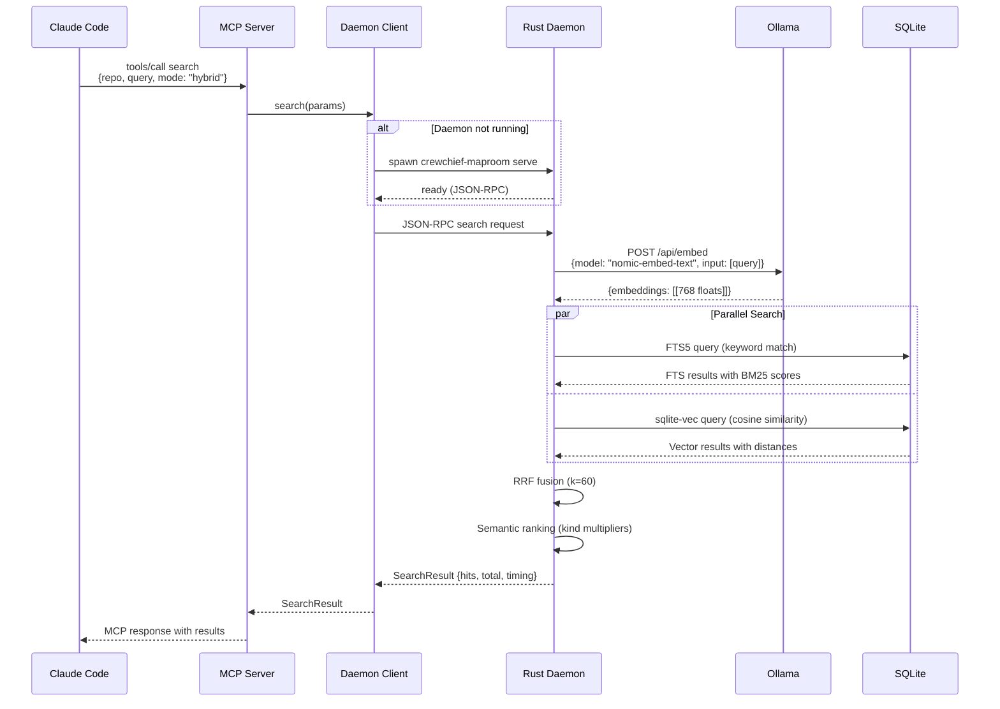
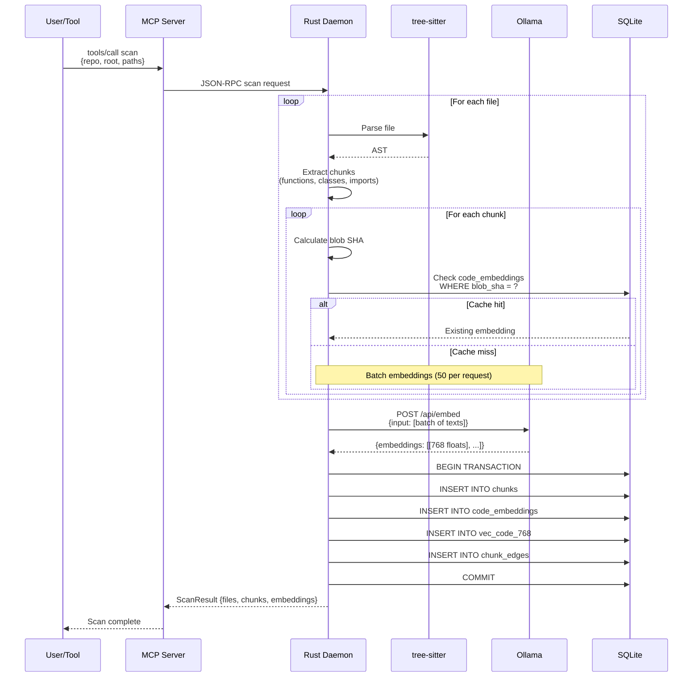
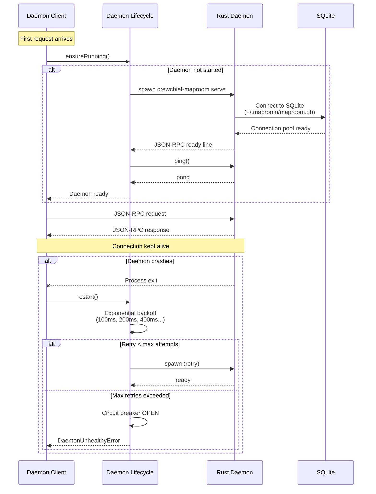
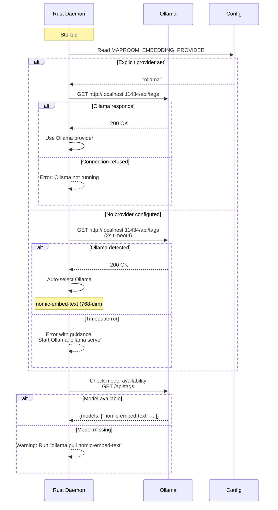
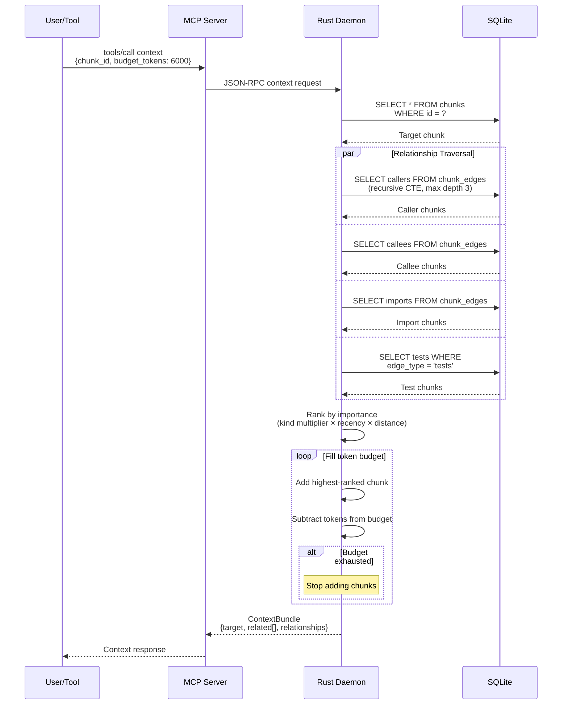

# Maproom Sequence Diagrams

Detailed request/response flows for key operations.

## 1. Search Request Flow

## 2. Indexing Flow (Scan)

## 3. Daemon Lifecycle

## 4. Provider Auto-Detection

## 5. Context Assembly Flow

## Timing Characteristics

| Operation | Typical Duration | Notes |
|-----------|------------------|-------|
| Daemon startup | 200-500ms | First request only |
| Ollama embed (single) | 50-100ms | Local GPU accelerated |
| Ollama embed (batch 50) | 500-800ms | Parallel processing |
| FTS5 search | 5-20ms | BM25 ranking |
| Vector search | 10-30ms | sqlite-vec cosine |
| Hybrid fusion | < 5ms | In-memory RRF |
| Context assembly | 20-50ms | Graph traversal |
| Full search (warm) | < 50ms | End-to-end |
