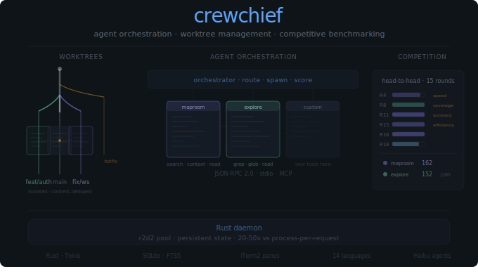

# CrewChief CLI

<p align="center">
  
</p>

A powerful command-line tool for git worktree management, semantic code search, and AI agent orchestration.

## Installation

```bash
# Check compatibility before installing
npx @crewchief/cli doctor

# Install globally
npm install -g @crewchief/cli

# Now use directly
crewchief --help
```

(Also works with yarn, pnpm, bun, and other npm-compatible package managers)

## Requirements

- **Node.js >= 18**
- **Git** (for worktree management)
- **iTerm2** (optional, macOS only -- for AI agent orchestration) — [download](https://iterm2.com/downloads.html)
- **tmux** (optional, Linux/Windows -- for AI agent orchestration) — `sudo apt install tmux` or `brew install tmux`
- **CLI agent tools** (`claude`, `gemini`, etc.) must be installed for agent orchestration

## Quick Start

### Basic Worktree Management

```bash
# Create and switch to a new worktree
crewchief worktree create feature-branch

# List all worktrees
crewchief worktree list

# Switch to an existing worktree (creates if needed)
crewchief worktree use feature-branch

# Merge worktree changes back to source branch
crewchief worktree merge feature-branch

# Clean up worktrees
crewchief worktree clean --all
```

### Enhanced Worktree Cleanup

The `worktree clean` command now performs complete cleanup by default:

```bash
# Clean single worktree (removes directory, git metadata, branch, and maproom records)
crewchief worktree clean feature-123

# Clean all non-current worktrees
crewchief worktree clean --all

# Keep the git branch (only remove worktree)
crewchief worktree clean feature-123 --keep-branch

# Skip maproom database cleanup
crewchief worktree clean feature-123 --keep-maproom

# Keep directory (only remove git metadata)
crewchief worktree clean feature-123 --keep-dir

# Combine flags
crewchief worktree clean feature-123 --keep-branch --keep-maproom
```

**What Gets Cleaned:**

- Worktree directory (unless `--keep-dir`)
- Git worktree metadata
- Git branch via safe delete (unless `--keep-branch`)
- Maproom database records (unless `--keep-maproom`)

**Graceful Error Handling:**

The clean command uses best-effort cleanup and continues even if some steps fail:

- **Maproom binary not found:** Warns and continues (directory and branch still cleaned)
- **Branch not fully merged:** Warns and continues (directory still cleaned, provides manual delete instructions)
- **Branch checked out elsewhere:** Warns and continues (provides instructions to switch other worktree)
- **Multiple failures:** Each failure logged separately with recovery instructions

**Common Troubleshooting:**

If maproom binary is not found:

```bash
# Install maproom globally
pnpm install -g @crewchief/cli

# Or run cleanup manually
maproom db cleanup-stale --confirm
```

If branch deletion fails (not fully merged):

```bash
# Review commits before force deleting
git log feature-branch

# Force delete if you're sure
git branch -D feature-branch

# Or merge first
git checkout main
git merge feature-branch
```

If branch is checked out in another worktree:

```bash
# Find which worktree has the branch
git worktree list

# Switch that worktree to different branch
cd /path/to/other/worktree
git checkout main

# Then delete the branch
git branch -d feature-branch
```

### Semantic Code Search

#### Recommended: Using Maproom MCP

For the best experience with AI assistants like Claude and Cursor, use the Maproom MCP server. This allows AI assistants to search your indexed codebase directly.

See the [maproom-mcp package](https://www.npmjs.com/package/maproom-mcp) for installation and setup instructions.

#### Direct CLI Usage

Index and search your codebase using SQLite:

```bash
# Index your codebase (creates ~/.maproom/maproom.db)
crewchief maproom scan

# Search semantically
crewchief maproom search "authentication flow"

# Watch for changes and auto-index
crewchief maproom watch
```

#### Auto-Scan Configuration

By default, worktree operations do NOT automatically trigger maproom indexing. This keeps worktree creation fast.

To enable auto-scan when creating worktrees, add to your `crewchief.config.js`:

```javascript
export default {
  worktree: {
    autoScanOnWorktreeUse: true, // Enable auto-indexing
  },
}
```

**Trade-offs**:

- **Auto-scan enabled**: New worktrees are immediately searchable, but creation is slower (5-30s depending on repo size)
- **Auto-scan disabled** (default): Fast worktree operations, but you must manually run `crewchief maproom scan` when needed

**Manual scanning**:

```bash
# After creating a worktree, index it manually:
crewchief maproom scan
```

**Migration from older versions**: If you relied on automatic scanning, simply add `autoScanOnWorktreeUse: true` to your config.

### AI Agent Orchestration

Agent orchestration supports three modes: **iTerm2** (default on macOS) for visual terminal management, **tmux** (recommended on Linux/Windows) for cross-platform terminal multiplexing, and **Headless** for non-interactive or server environments.

The backend is auto-detected: if you are running inside a tmux session, tmux is used automatically. On macOS inside iTerm2, iTerm2 is used. Otherwise, headless mode is the fallback.

#### iTerm2 Mode (Default on macOS)

Requires iTerm2 on macOS. Agents run in dedicated terminal panes.

```bash
# Spawn AI agents with dedicated worktrees
crewchief spawn claude "implement-auth"
crewchief spawn gemini "code-review"

# Spawn multiple agents at once
crewchief spawn claude,gemini "fix-bug"

# List running agents
crewchief agent list

# Send messages to agents
crewchief agent message implement-auth__claude "Add OAuth support"

# Send message to all agents on a task
crewchief agent message implement-auth --all "Update approach"
```

#### tmux Mode (Linux/Windows)

Recommended for Linux and Windows (WSL). Agents run in dedicated tmux windows/panes. tmux must be installed (`sudo apt install tmux` on Debian/Ubuntu, `brew install tmux` on macOS).

```bash
# Auto-detected when running inside a tmux session:
tmux
crewchief spawn claude "implement the login feature"

# Or configure tmux as the default backend in crewchief.config.js:
#   terminal: { backend: 'tmux' }

# Agents appear as tmux windows — view them with:
tmux list-windows
tmux list-panes -s

# Attach to see agent output:
tmux attach -t crewchief
```

**Why tmux?** tmux sessions persist across terminal disconnects, making it ideal for long-running agent tasks. Agents survive SSH disconnections and terminal closures.

#### Headless Mode

For non-iTerm2/non-tmux environments (servers, CI/CD, other terminals). Agents run as background processes.

```bash
# Spawn agents in headless mode
crewchief spawn mock-agent "task-name" --headless

# Spawn multiple agents in headless mode
crewchief spawn claude,gemini "fix-bug" --headless

# Headless agents communicate via stdin pipe
# The process stays alive to stream logs and manage child processes
```

**Note:** In headless mode, agent panes are logical processes rather than terminal panes. Messages are sent via stdin pipe to the agent process.

## Database Setup

Semantic code search uses SQLite for zero-configuration storage. The database is automatically created at `~/.maproom/maproom.db` when you first run `maproom scan`.

### Custom Database Location

```bash
# Use a custom database path
export MAPROOM_DATABASE_URL="sqlite:///path/to/custom.db"
```

## Embedding Provider Setup

Semantic search uses embeddings to understand code semantically. Choose one provider:

### OpenAI (Recommended for Production)

Fast, high-quality embeddings with minimal setup:

```bash
# Set provider and API key
export MAPROOM_EMBEDDING_PROVIDER=openai
export OPENAI_API_KEY=sk-your-api-key-here

# Optional: specify model (default: text-embedding-3-small)
export MAPROOM_EMBEDDING_MODEL=text-embedding-3-small

# Index your codebase
crewchief maproom scan
```

**Cost:** ~$0.02 per 1GB of code indexed

### Google Vertex AI

Enterprise-grade embeddings with Google Cloud integration:

```bash
# Set provider
export MAPROOM_EMBEDDING_PROVIDER=google

# Configure Google Cloud credentials
export GOOGLE_PROJECT_ID=your-project-id
export GOOGLE_APPLICATION_CREDENTIALS=/path/to/service-account-key.json

# Optional: specify region (default: us-west1)
export GOOGLE_VERTEX_REGION=us-central1

# Index your codebase
crewchief maproom scan
```

**Requirements:**

- Google Cloud project with Vertex AI API enabled
- Service account with Vertex AI permissions
- Download service account JSON key

### Ollama (Local, Private)

Run embeddings locally with no API costs or external dependencies:

```bash
# Install Ollama (macOS)
brew install ollama

# Set provider
export MAPROOM_EMBEDDING_PROVIDER=ollama

# Optional: specify model (default: mxbai-embed-large)
export MAPROOM_EMBEDDING_MODEL=mxbai-embed-large

# Index your codebase
crewchief maproom scan
```

**Pros:** Free, private, no internet required
**Cons:** Slower than cloud providers, requires local compute

## Performance Optimization

The maproom indexer includes several performance features to handle large codebases efficiently.

### Incremental Scanning (Default)

By default, `maproom scan` uses **incremental scanning** to only index changed files:

- Compares git tree SHA between runs
- Skips unchanged files automatically
- Dramatically faster for subsequent scans (10x+ speedup)
- Use `--force` to bypass and scan all files

```bash
# Incremental scan (default) - only changed files
crewchief maproom scan

# Force full re-index - scan all files
crewchief maproom scan --force
```

**When to use `--force`:**

- After schema migrations
- When switching embedding providers
- If incremental scan produces unexpected results

### Parallel Processing

Enable parallel processing for large repositories (>10k files):

```bash
# Enable parallel mode with default workers (4)
crewchief maproom scan --parallel

# Customize worker count for multi-core systems
crewchief maproom scan --parallel --parallel-workers 8
```

**Performance:** 4x+ faster on large codebases with multi-core CPUs.

**Trade-off:** Higher memory usage during indexing.

### Batch Size Tuning

Adjust batch sizes for optimal performance based on your environment:

```bash
# Larger batches for faster indexing (more memory)
crewchief maproom scan --batch-size 100 --embedding-batch-size 100

# Smaller batches for memory-constrained environments
crewchief maproom scan --batch-size 25 --embedding-batch-size 25
```

**Parameters:**

- `--batch-size` - Database insert batch size (default: 50)
- `--embedding-batch-size` - Embedding generation batch size (default: 50)

**Recommendation:** Start with defaults, increase for faster indexing on powerful machines.

## Configuration

### Binary Configuration

Specify a custom path to the maproom binary for local development or custom installations:

```javascript
// crewchief.config.js
export default {
  repository: {
    maproomBinaryPath: './target/release/maproom',
  },
}
```

**Resolution Priority:**

1. `MAPROOM_BIN` environment variable
2. `CREWCHIEF_MAPROOM_BIN` environment variable (deprecated alias for `MAPROOM_BIN`)
3. `config.repository.maproomBinaryPath` (config file)
4. Global install (`npm install -g @crewchief/cli`)
5. Packaged binary (bundled with npm package)

**Common Use Cases:**

**Local Rust Development:**

```javascript
export default {
  repository: {
    // Relative path from repository root
    maproomBinaryPath: './target/release/maproom',
  },
}
```

**Shared Team Build:**

```javascript
export default {
  repository: {
    // Absolute path to shared binary
    maproomBinaryPath: '/shared/builds/maproom',
  },
}
```

**CI/CD with Specific Version:**

```javascript
export default {
  repository: {
    maproomBinaryPath: '/opt/crewchief/bin/maproom',
  },
}
```

See [docs/development/local-development.md](../../docs/development/local-development.md) for complete development workflows.

### Configuration Wizard

Run the interactive setup wizard on first use:

```bash
crewchief setup
```

This will guide you through:

- Repository type (standard or monorepo)
- Main branch name
- Files to copy to new worktrees (.env files, etc.)
- Whether to update LLM guide files (CLAUDE.md, etc.)

The wizard creates a `crewchief.config.js` file in your project root with your preferences.

**Tip:** Add `.crewchief` to your `.gitignore` file to avoid committing worktree data.

### Manual Configuration

You can also manually create `crewchief.config.js`:

```javascript
export default {
  repository: {
    mainBranch: 'main',
    worktreeBasePath: '.crewchief/worktrees',
  },
  worktree: {
    // Auto-copy .env files to new worktrees
    copyIgnoredFiles: ['.env', '.env.local'],
    copyFromPath: '.',
    overwriteStrategy: 'skip', // 'skip', 'overwrite', or 'backup'
  },
  terminal: {
    backend: 'iterm', // Options: 'iterm' (macOS), 'tmux' (Linux/Windows), 'headless', 'auto'
    iterm: {
      sessionName: 'crewchief',
    },
  },
  evaluation: {
    autoMergeThreshold: 0.95,
    requireTestsPass: true,
    requireReview: false,
  },
}
```

## Worktree Configuration

### Worktree Path Configuration

CrewChief allows you to configure where worktrees are created using flexible path patterns. By default, worktrees are created in `~/.crewchief/worktrees/<repo-name>` to keep them isolated per repository and outside the main repository directory.

#### Supported Path Patterns

**Tilde Expansion**

`~` expands to your home directory:

```javascript
export default {
  repository: {
    worktreeBasePath: '~/worktrees',
  },
}
// Linux/macOS: /home/username/worktrees
// Windows: C:\Users\username\worktrees
```

**Repository Placeholder**

`<repo-name>` is replaced with your repository name:

```javascript
export default {
  repository: {
    worktreeBasePath: '~/.crewchief/worktrees/<repo-name>',
  },
}
// Example: ~/.crewchief/worktrees/myproject
```

Repository name is extracted from:

1. Git remote URL (e.g., `git@github.com:org/myproject.git` → `myproject`)
2. Directory basename (fallback if not a git repo)

Special characters (`/`, `\`, `:`, `*`, `?`, `"`, `<`, `>`, `|`) in repository names are automatically replaced with `-`.

**Absolute Paths**

Full paths work without joining to repository root:

```javascript
export default {
  repository: {
    worktreeBasePath: '/tmp/worktrees',
  },
}
```

**Relative Paths**

Paths without `/` or `~` are relative to repository root:

```javascript
export default {
  repository: {
    worktreeBasePath: '.crewchief/worktrees',  // Inside repo (legacy)
  },
}
// Or
export default {
  repository: {
    worktreeBasePath: '../worktrees',  // Adjacent to repo
  },
}
```

#### Configuration Examples

```javascript
// Default: per-repo isolation in home directory
export default {
  repository: {
    worktreeBasePath: '~/.crewchief/worktrees/<repo-name>',
  },
}

// Custom: fast SSD with repo isolation
export default {
  repository: {
    worktreeBasePath: '/mnt/ssd/worktrees/<repo-name>',
  },
}

// Custom: shared team location
export default {
  repository: {
    worktreeBasePath: '/shared/dev/worktrees/<repo-name>',
  },
}

// Legacy: inside repository (v1.x behavior)
export default {
  repository: {
    worktreeBasePath: '.crewchief/worktrees',
  },
}

// Simple: home directory, all repos together
export default {
  repository: {
    worktreeBasePath: '~/worktrees',
  },
}
```

### Migration from v1.x

#### Breaking Change: Default Worktree Location

**v1.x default**: `.crewchief/worktrees` (inside repository)
**v2.0+ default**: `~/.crewchief/worktrees/<repo-name>` (outside repository)

#### Why This Change?

- **Repository isolation**: Multiple repositories can coexist without conflicts
- **Clean git status**: Worktrees outside repo don't clutter git status
- **Centralized management**: All worktrees in one location across projects
- **Developer experience**: Common convention used by other tools

#### Migration Options

**Option 1: Accept New Default (Recommended)**

Do nothing. New worktrees will be created in `~/.crewchief/worktrees/<repo-name>/`.

**Existing worktrees continue to work** - git manages them by path, not location.

You'll have worktrees in two locations temporarily:

- Old: `.crewchief/worktrees/feature-old`
- New: `~/.crewchief/worktrees/myproject/feature-new`

You can manually migrate old worktrees or leave them in place.

**Option 2: Revert to Old Behavior**

Add to `crewchief.config.js`:

```javascript
export default {
  repository: {
    worktreeBasePath: '.crewchief/worktrees',
  },
}
```

All worktrees will continue to be created inside the repository.

**Option 3: Custom Location**

Use any path pattern:

```javascript
export default {
  repository: {
    // SSD for performance
    worktreeBasePath: '/mnt/ssd/worktrees/<repo-name>',

    // Shared team location
    worktreeBasePath: '/shared/worktrees/<repo-name>',

    // Home directory without repo name
    worktreeBasePath: '~/dev/worktrees',
  },
}
```

#### Manual Worktree Migration

To move existing worktrees to the new location:

```bash
# 1. List existing worktrees
git worktree list

# 2. Remove old worktree
git worktree remove .crewchief/worktrees/feature-x

# 3. Create in new location
crewchief worktree create feature-x

# Note: This creates a fresh checkout. Local changes are lost.
# Commit changes before migration!
```

#### Repository Rename Behavior

If you rename your repository or change the remote URL:

- **Existing worktrees continue to work** (git manages them by absolute path)
- **New worktrees use the new repository name** in their path
- **Worktree paths are fixed at creation time** and don't update automatically
- **This is expected behavior** - no action needed unless you want to consolidate paths

### Worktree Troubleshooting

#### "Invalid worktree path: system directory not allowed"

**Cause**: Configured path resolves to a system directory (`/`, `/etc`, `/usr`, `/System`, `C:\Windows`)

**Solution**: Use a non-system directory:

```javascript
// Bad
export default {
  repository: {
    worktreeBasePath: '/etc',
  },
}

// Good
export default {
  repository: {
    worktreeBasePath: '~/worktrees',
  },
}
// Or
export default {
  repository: {
    worktreeBasePath: '/home/user/worktrees',
  },
}
```

#### "Could not expand <repo-name>: not in a git repository"

**Cause**: Used `<repo-name>` placeholder but not in a git repository

**Solution**:

- Run commands from inside a git repository
- Or use a path without `<repo-name>` placeholder
- The placeholder is replaced with directory name as fallback

#### Permission Denied Creating Worktree

**Cause**: Configured path is not writable

**Solution**:

```bash
# Verify directory permissions
ls -la ~/

# Create directory manually
mkdir -p ~/.crewchief/worktrees

# Choose different location with write access
```

Update your config if needed:

```javascript
export default {
  repository: {
    worktreeBasePath: '~/worktrees', // Use a writable location
  },
}
```

#### Worktrees in Two Locations After Upgrade

**Cause**: Upgraded from v1.x with new default location

**Solution**: This is expected. See [Migration from v1.x](#migration-from-v1x) for options:

- **Keep both locations** (old worktrees still work)
- **Revert to old behavior** with config override
- **Manually migrate worktrees** to new location

#### Repository Name Has Special Characters

**Cause**: Repository name contains `/`, `\`, `:`, `*`, `?`, `"`, `<`, `>`, `|`

**Solution**: These characters are automatically replaced with `-`.

Example: Repository name `my/repo` becomes `my-repo` in the path.

```javascript
// Repository: my/repo
// Config:
export default {
  repository: {
    worktreeBasePath: '~/.crewchief/worktrees/<repo-name>',
  },
}
// Result: ~/.crewchief/worktrees/my-repo
```

## Command Reference

All commands below should be prefixed with `crewchief`. For example: `crewchief worktree create feature-branch`

### Worktree Commands

| Command                         | Description                                               |
| ------------------------------- | --------------------------------------------------------- |
| `worktree create <name>`        | Create a new worktree                                     |
| `worktree list`                 | List all worktrees                                        |
| `worktree use <name>`           | Switch to worktree (creates if needed)                    |
| `worktree merge <name>`         | Merge worktree changes back                               |
| `worktree clean [selector]`     | Remove worktree (directory, metadata, branch, db records) |
| `worktree clean --all`          | Remove all non-current worktrees                          |
| `worktree clean --keep-branch`  | Keep git branch after removing worktree                   |
| `worktree clean --keep-maproom` | Skip maproom database cleanup                             |
| `worktree clean --keep-dir`     | Keep directory (only remove git metadata)                 |
| `worktree clean --stale`        | Remove only stale worktree metadata                       |
| `worktree copy-ignored <name>`  | Copy .env files to worktree                               |

### Maproom Commands (Semantic Search)

| Command                       | Description                    |
| ----------------------------- | ------------------------------ |
| `maproom scan`                | Index your codebase            |
| `maproom search <query>`      | Search code semantically       |
| `maproom watch`               | Auto-index on file changes     |
| `maproom upsert [files...]`   | Update specific files          |
| `maproom generate-embeddings` | Generate embeddings for chunks |

**Note:** For AI assistant integration, install [`@crewchief/maproom-mcp`](https://www.npmjs.com/package/@crewchief/maproom-mcp) instead of using these commands directly. The [`maproom`](https://crates.io/crates/maproom) Rust binary powers both the CLI commands and the MCP server.

### Agent Commands (iTerm2, tmux, or Headless Mode)

| Command                      | Description           |
| ---------------------------- | --------------------- |
| `spawn <agents> [task]`      | Spawn AI agents       |
| `agent list`                 | List running agents   |
| `agent message <name> <msg>` | Send message to agent |
| `agent close <id>`           | Close agent pane      |

### System Commands

| Command  | Description                      |
| -------- | -------------------------------- |
| `setup`  | Interactive configuration wizard |
| `doctor` | Check dependencies               |

## Supported File Types for Indexing

- TypeScript (.ts, .tsx)
- JavaScript (.js, .jsx)
- Markdown (.md, .mdx)
- JSON (.json)
- YAML (.yaml, .yml)
- TOML (.toml)
- Rust (.rs)

## Alternative Installation Methods

### Run without installing

```bash
npx @crewchief/cli --help
```

### Install in a project

```bash
npm install @crewchief/cli
# Then run with:
npx crewchief --help
```

## Security Best Practices

Proper credential management is essential when working with API keys.

### Option 1: .env File (Development)

Create a `.env` file in your project root with restricted permissions:

```bash
# Create .env file (never commit!)
cat > .env <<EOF
MAPROOM_EMBEDDING_PROVIDER=openai
OPENAI_API_KEY=sk-...
EOF

# Restrict permissions to owner-only
chmod 600 .env

# Add to .gitignore
echo ".env" >> .gitignore
```

**Automatic loading with direnv:**

```bash
# Install direnv (macOS)
brew install direnv

# Add hook to your shell (~/.bashrc or ~/.zshrc)
eval "$(direnv hook bash)"  # or 'zsh'

# Create .envrc instead of .env
cat > .envrc <<EOF
export MAPROOM_EMBEDDING_PROVIDER=openai
export OPENAI_API_KEY=sk-...
EOF

# Allow the directory
direnv allow
```

### Option 2: Secret Manager (Production)

Use external secret management for production environments:

**AWS Secrets Manager:**

```bash
# Fetch API key from AWS Secrets Manager
export OPENAI_API_KEY=$(aws secretsmanager get-secret-value \
  --secret-id openai-key \
  --query SecretString \
  --output text)

# Run crewchief commands
crewchief maproom scan
```

**HashiCorp Vault:**

```bash
# Authenticate to Vault
vault login -method=token

# Fetch credentials from Vault KV store
export OPENAI_API_KEY=$(vault kv get -field=key maproom/openai)

# Run crewchief commands
crewchief maproom scan
```

**Benefits of secret managers:**

- Centralized credential storage
- Audit logging of access
- Automatic rotation support
- Fine-grained access control
- No credentials in source code or shell history

### Security Warnings

**Critical:**

- **Never commit credentials to git** - Always use `.gitignore` for `.env` files
- **Rotate API keys regularly** - Especially after potential exposure
- **Environment variables are visible** to all processes - use `.env` files or secret managers for better isolation
- **Consider IAM roles** instead of static credentials (AWS, GCP) for cloud deployments

**File permissions:**

```bash
# Verify .env permissions (should be 600)
ls -la .env
# -rw------- 1 user group 123 Jan 10 12:00 .env

# Fix if needed
chmod 600 .env
```

## Troubleshooting

### Check system dependencies

```bash
crewchief doctor
```

This will check for:

- Node.js version (>= 18 required)
- Git installation
- iTerm2 availability (macOS only, optional -- needed for agent orchestration)
- tmux availability (optional -- needed for agent orchestration on Linux/Windows)

### Common Issues

#### Embedding Provider Errors

**Symptom:** `Embedding generation failed` or `Provider not configured`

**Solutions:**

**For OpenAI:**

1. Verify API key is set:

   ```bash
   echo $OPENAI_API_KEY
   # Should start with: sk-...
   ```

2. Check API key permissions at https://platform.openai.com/api-keys

3. Ensure you have credits available

**For Google Vertex AI:**

1. Verify environment variables:

   ```bash
   echo $GOOGLE_PROJECT_ID
   echo $GOOGLE_APPLICATION_CREDENTIALS
   ```

2. Test service account authentication:

   ```bash
   gcloud auth activate-service-account --key-file=$GOOGLE_APPLICATION_CREDENTIALS
   ```

3. Ensure Vertex AI API is enabled in your project

**For Ollama:**

1. Check if Ollama is running:

   ```bash
   ollama list
   ```

2. Verify model is pulled:

   ```bash
   ollama list | grep mxbai-embed-large
   ```

3. If model missing, pull it manually:
   ```bash
   ollama pull mxbai-embed-large
   ```

#### Binary Compatibility Issues

**Symptom:** `maproom binary not found` or `command not found`

**Solutions:**

1. **Rebuild the Rust binary:**

   ```bash
   cd packages/cli
   pnpm build:rust
   ```

2. **Verify binary exists:**

   ```bash
   ls -la packages/cli/bin/$(uname -s | tr '[:upper:]' '[:lower:]')-$(uname -m)/
   ```

3. **Check platform compatibility:**
   - macOS: darwin-arm64 (Apple Silicon) or darwin-x64 (Intel)
   - Linux: linux-x64 or linux-arm64
   - Windows: Not currently supported for direct Rust binary usage

#### iTerm2 Not Found

**Symptom:** `iTerm2 is required to run CrewChief` or agent features don't work

**Solutions:**

1. Install iTerm2: https://iterm2.com/downloads.html

2. Ensure you're running commands _inside_ iTerm2, not Terminal.app

3. Verify iTerm2 version (>= 3.4 recommended):
   - iTerm2 → About iTerm2

**Note:** On macOS, agent orchestration uses iTerm2. On Linux and Windows, use `--backend tmux` or run inside a tmux session for automatic detection. Worktree and semantic search work on all platforms.

#### Worktree Creation Failed

**Symptom:** `fatal: not a git repository` or `worktree creation failed`

**Solutions:**

1. Ensure you're in a git repository:

   ```bash
   git status
   ```

2. Verify at least one commit exists:

   ```bash
   git log
   ```

3. Check for uncommitted changes that might conflict:
   ```bash
   git status
   ```

#### Environment Variable Debugging

If you're unsure which variables are set:

```bash
# Check all MAPROOM variables
env | grep MAPROOM

# Check embedding provider
env | grep -E "(MAPROOM_EMBEDDING|OPENAI|GOOGLE|OLLAMA)"
```

### Getting Help

If issues persist:

1. Run `crewchief doctor` and share the output
2. Check logs: `~/.crewchief/logs/` (if exists)
3. Open an issue at https://github.com/manifoldlogic/crewchief/issues with:
   - Error message (remove sensitive data)
   - Output of `crewchief doctor`
   - Platform and Node.js version
