# CrewChief Web UI Database Schema

This document describes the PostgreSQL database schema for the CrewChief Web UI, which extends the existing Maproom database with tables for web interface functionality.

## Overview

The Web UI schema consists of 6 main tables that handle user sessions, search history, preferences, agent operations, and caching. All tables use the `web_` prefix to avoid conflicts with existing Maproom tables.

## Schema Diagram

```mermaid
erDiagram
    %% Existing Maproom Tables (referenced)
    maproom_repos {
        bigint id PK
        text name
        text root_path
    }
    
    maproom_worktrees {
        bigint id PK
        bigint repo_id FK
        text name
        text abs_path
        timestamptz indexed_at
    }

    %% Web UI Tables
    web_sessions {
        bigint id PK
        uuid session_id UK
        text user_id
        text auth_token UK
        timestamptz expires_at
        timestamptz created_at
        timestamptz last_accessed
        inet ip_address
        text user_agent
        boolean is_active
        jsonb session_data
    }

    web_search_history {
        bigint id PK
        uuid session_id FK
        text user_id
        text query
        text search_type
        jsonb filters
        integer result_count
        integer execution_time_ms
        real relevance_threshold
        jsonb top_results
        jsonb performance_metrics
        timestamptz searched_at
        integer_array clicked_results
        boolean saved
        bigint repo_id FK
        bigint worktree_id FK
    }

    web_ui_preferences {
        bigint id PK
        uuid session_id FK
        text user_id
        text preference_key
        jsonb preference_value
        timestamptz created_at
        timestamptz updated_at
        text scope
        text context_id
        integer version
    }

    agent_runs {
        bigint id PK
        text agent_id
        agent_type agent_type
        uuid run_id UK
        uuid parent_run_id FK
        bigint repo_id FK
        bigint worktree_id FK
        text commit_sha
        text task_description
        text task_type
        jsonb instructions
        text_array context_files
        agent_status status
        timestamptz started_at
        timestamptz completed_at
        bigint duration_ms
        text tmux_session
        integer tmux_window
        integer tmux_pane
        integer exit_code
        text error_message
        jsonb artifacts
        real evaluation_score
        boolean tests_passed
        boolean review_required
        boolean auto_merge_eligible
        real cpu_usage_avg
        bigint memory_usage_peak
        bigint disk_io_bytes
        integer network_requests
        text stdout_log_path
        text stderr_log_path
        text log_summary
        timestamptz created_at
        timestamptz updated_at
        uuid competition_id
        integer competition_rank
        jsonb user_feedback
        boolean bookmarked
        text_array tags
    }

    agent_messages {
        bigint id PK
        uuid message_id UK
        uuid correlation_id
        uuid reply_to_id FK
        uuid run_id FK
        text sender_agent_id
        text recipient_agent_id
        message_type message_type
        message_priority priority
        text subject
        text content
        text content_format
        jsonb metadata
        jsonb attachments
        boolean broadcast
        timestamptz delivered_at
        timestamptz acknowledged_at
        timestamptz created_at
        timestamptz expires_at
        boolean processed
        jsonb processing_result
        integer retry_count
        integer max_retries
        text bus_topic
        integer bus_partition
        bigint bus_offset
        text_array tags
        tsvector search_vector
        integer size_bytes
        integer processing_time_ms
    }

    worktree_status {
        bigint id PK
        bigint worktree_id UK
        bigint repo_id FK
        text worktree_name
        text worktree_path
        text current_branch
        text upstream_branch
        worktree_state state
        boolean is_clean
        boolean is_synced
        text head_commit_sha
        text head_commit_message
        text head_commit_author
        timestamptz head_commit_date
        integer commits_ahead
        integer commits_behind
        integer modified_files
        integer added_files
        integer deleted_files
        integer untracked_files
        integer staged_files
        jsonb file_changes
        integer total_files
        bigint total_size_bytes
        jsonb programming_languages
        jsonb active_agents
        text_array tmux_sessions
        bigint disk_usage_bytes
        text last_build_status
        timestamptz last_build_time
        text test_status
        real test_coverage
        timestamptz maproom_indexed_at
        text maproom_index_status
        integer chunk_count
        timestamptz last_scan_at
        integer scan_duration_ms
        integer cache_version
        text last_error
        integer error_count
        timestamptz last_accessed_at
        boolean pinned
        text_array tags
        text notes
        timestamptz created_at
        timestamptz updated_at
    }

    %% Relationships
    web_sessions ||--o{ web_search_history : session_id
    web_sessions ||--o{ web_ui_preferences : session_id
    
    maproom_repos ||--o{ web_search_history : repo_id
    maproom_worktrees ||--o{ web_search_history : worktree_id
    maproom_repos ||--o{ agent_runs : repo_id
    maproom_worktrees ||--o{ agent_runs : worktree_id
    maproom_repos ||--o{ worktree_status : repo_id
    maproom_worktrees ||--|| worktree_status : worktree_id
    
    agent_runs ||--o{ agent_messages : run_id
    agent_runs ||--o{ agent_runs : parent_run_id
    agent_messages ||--o{ agent_messages : reply_to_id
```



## Table Descriptions

### 1. web_sessions
**Purpose**: Manages user authentication and session state for the web interface.

**Key Features**:
- UUID-based session identifiers
- Configurable session expiration
- IP and user agent tracking
- Flexible session data storage via JSONB
- Automatic cleanup of expired sessions

**Indexes**:
- Unique indexes on `session_id` and `auth_token`
- Performance indexes on `expires_at` and `last_accessed`
- Partial index for active sessions only

### 2. web_search_history
**Purpose**: Tracks search queries, results, and performance metrics for the Maproom search interface.

**Key Features**:
- Multiple search types (semantic, fulltext, symbol, path)
- Detailed performance metrics and query optimization data
- User interaction tracking (clicked results, saved searches)
- Full-text search on query content
- Connection to Maproom repository and worktree context

**Indexes**:
- Performance indexes on session, user, and search metadata
- GIN indexes for JSONB filter and result data
- Full-text search indexes on query content

### 3. web_ui_preferences
**Purpose**: Stores user interface preferences with hierarchical scoping.

**Key Features**:
- Hierarchical preference scoping (global, repository, worktree, page)
- JSONB storage for flexible preference values
- Built-in preference validation via enum types
- Automatic versioning for preference migration
- Helper functions for getting/setting preferences

**Scopes**:
- `global`: User-wide preferences
- `repository`: Repository-specific settings
- `worktree`: Worktree-specific configurations
- `page`: Page-specific UI state

### 4. agent_runs
**Purpose**: Comprehensive tracking of agent execution history, performance, and outcomes.

**Key Features**:
- Complete run lifecycle tracking (pending → running → completed/failed)
- Performance metrics (CPU, memory, disk I/O, network)
- Competition framework support with ranking
- Artifact tracking (files created/modified, commits made)
- User feedback and bookmarking
- Hierarchical runs with parent-child relationships

**States**: `pending`, `running`, `completed`, `failed`, `cancelled`, `timeout`

### 5. agent_messages
**Purpose**: Inter-agent communication logs and message bus integration.

**Key Features**:
- Multiple message types (command, response, notification, error, log, etc.)
- Message threading with reply-to relationships
- Priority-based message handling
- Message bus integration (topic, partition, offset)
- Full-text search on message content
- Automatic retry logic with configurable limits
- Message expiration and cleanup

**Message Types**: `command`, `response`, `notification`, `error`, `log`, `status_update`, `file_change`, `git_event`, `system_event`

### 6. worktree_status
**Purpose**: Cached git status and metadata for worktrees to improve UI performance.

**Key Features**:
- Git status caching (commits ahead/behind, file changes)
- Active agent tracking per worktree
- Build and test status monitoring
- Directory analysis (languages, file counts, sizes)
- User interaction tracking (last accessed, pinned, notes)
- Configurable cache invalidation strategies

**States**: `active`, `stale`, `merging`, `archived`, `error`

## Database Functions

### Session Management
- `cleanup_expired_sessions()`: Automatic cleanup of expired sessions
- Session validation and token management

### Search Analytics
- `get_popular_searches(timeframe, limit)`: Get trending search queries
- `cleanup_old_search_history()`: Remove old search data based on retention policies

### Preferences Management
- `get_session_preferences(session_id, scope, context_id)`: Retrieve user preferences
- `set_preference(session_id, key, value, scope, context_id)`: Upsert preference values
- `get_default_preferences()`: Get system default preferences
- `reset_preferences_to_defaults(session_id)`: Reset user preferences

### Agent Operations
- `get_run_statistics(days_back, agent_type, worktree)`: Performance analytics
- `get_recent_runs(limit, status_filter)`: Recent agent activity
- `cleanup_old_agent_runs()`: Archive old runs and cleanup logs

### Message Processing
- `get_message_thread(message_id, include_descendants)`: Get conversation threads
- `get_recent_messages(agent_id, run_id, limit, types)`: Query message history
- `mark_message_processed(message_id, result, processing_time)`: Update message status
- `cleanup_old_agent_messages()`: Message retention management

### Worktree Management
- `update_worktree_status(worktree_id, git_status, file_summary, agent_info)`: Cache update
- `mark_worktree_accessed(worktree_id)`: Track user activity
- `get_worktree_summary(repo_id, include_archived)`: Dashboard summary
- `mark_stale_worktrees()`: Identify inactive worktrees
- `cleanup_worktree_status_cache()`: Cache maintenance

## Enums and Types

### Custom Enum Types
- `agent_status`: `pending`, `running`, `completed`, `failed`, `cancelled`, `timeout`
- `agent_type`: `claude`, `gemini`, `mock`, `custom`
- `message_type`: `command`, `response`, `notification`, `error`, `log`, `status_update`, `file_change`, `git_event`, `system_event`
- `message_priority`: `low`, `normal`, `high`, `critical`
- `worktree_state`: `active`, `stale`, `merging`, `archived`, `error`
- `git_file_status`: `unmodified`, `modified`, `added`, `deleted`, `renamed`, `copied`, `unmerged`, `untracked`, `ignored`
- `web_preference_key`: Predefined preference keys for validation

## Performance Considerations

### Indexing Strategy
- **Primary indexes**: All foreign keys and frequently queried columns
- **Composite indexes**: Multi-column WHERE clauses and JOIN conditions
- **Partial indexes**: Filtered for specific states (active sessions, recent data)
- **GIN indexes**: JSONB columns for flexible querying
- **Full-text indexes**: Search content and message text
- **Vector indexes**: Future support for semantic search embeddings

### Query Optimization
- Prepared statements for common queries
- Connection pooling with appropriate pool sizes
- Query result caching for expensive operations
- Automatic cleanup functions for data retention

### Caching Strategy
- **worktree_status**: Cache git status to avoid expensive filesystem operations
- **web_search_history**: Cache popular searches and query patterns
- **web_ui_preferences**: In-memory caching of frequently accessed preferences

## Security Features

### Data Protection
- Session token encryption and secure storage
- IP address tracking for security monitoring
- Automatic session expiration and cleanup
- SQL injection prevention through parameterized queries

### Access Control
- Session-based access control
- User-scoped data isolation
- Optional multi-user support via `user_id` fields

## Backup and Maintenance

### Data Retention
- **Sessions**: 30 days for inactive, configurable for active
- **Search History**: 30 days normal, 6 months for saved searches
- **Messages**: 7 days for logs, 30 days for notifications, 3 months for important messages
- **Agent Runs**: 3 months with log archival, longer for bookmarked runs

### Cleanup Procedures
- Automated cleanup functions with configurable schedules
- Graceful degradation for missing data
- Soft deletes where appropriate for data recovery

## Migration Information

### Migration Files Location
- **Path**: `packages/web-ui/migrations/`
- **Naming**: `NNNN_description.sql` (e.g., `0001_web_sessions.sql`)
- **Order**: Sequential execution based on filename sorting

### Migration Runner
- **Module**: `src/db/migrations.ts`
- **Features**: Checksum validation, rollback support, status tracking
- **Commands**: `runMigrations()`, `migrationStatus()`, `resetMigrations()`

### Seed Data
- **Location**: `packages/web-ui/seeds/`
- **Purpose**: Development and testing data
- **Runner**: `seeds/run_seeds.ts`
- **Content**: Sample sessions, search history, preferences, agent data

## Environment Configuration

### Required Environment Variables
```bash
CREWCHIEF_DB_HOST=localhost
CREWCHIEF_DB_PORT=5432
CREWCHIEF_DB_NAME=crewchief
CREWCHIEF_DB_USER=postgres
CREWCHIEF_DB_PASSWORD=your_password
CREWCHIEF_DB_SSL=false
CREWCHIEF_DB_POOL_MAX=20
CREWCHIEF_DB_POOL_MIN=5
```

### Connection Pool Settings
- **Maximum connections**: 20 (configurable)
- **Minimum connections**: 5 (configurable)
- **Connection timeout**: 5 seconds
- **Idle timeout**: 30 seconds
- **Statement timeout**: 30 seconds

## Future Enhancements

### Planned Features
1. **Real-time subscriptions**: WebSocket integration for live updates
2. **Advanced analytics**: Time-series data for performance monitoring
3. **User management**: Full multi-user support with roles and permissions
4. **API rate limiting**: Request throttling and quota management
5. **Audit logging**: Comprehensive change tracking and compliance
6. **Data export**: Bulk export functionality for data migration

### Scalability Considerations
1. **Read replicas**: Separate read and write operations
2. **Partitioning**: Time-based partitioning for large historical tables
3. **Archival**: Cold storage for old data
4. **Caching layers**: Redis integration for high-frequency data
5. **Connection pooling**: pgBouncer for connection management at scale

## Getting Started

### 1. Run Migrations
```typescript
import { runMigrations } from './src/db/migrations.js';
await runMigrations();
```

### 2. Seed Development Data
```typescript
import { runSeeds } from './seeds/run_seeds.js';
await runSeeds();
```

### 3. Connect to Database
```typescript
import { initializeDatabase } from './src/db/connection.js';
const db = await initializeDatabase();
```

### 4. Query with Builder
```typescript
import { QueryBuilder } from './src/db/query-builder.js';
const results = await new QueryBuilder('web_sessions')
  .where('is_active = ?', true)
  .orderBy('last_accessed', 'DESC')
  .limit(10)
  .execute();
```

This schema provides a robust foundation for the CrewChief Web UI, with careful attention to performance, scalability, and maintainability while seamlessly integrating with the existing Maproom database infrastructure.